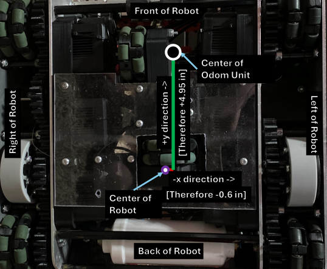

# Configuring Odometry

## Configuring Sensors

I don't like straight-cut tutorials, said *no one ever*. It is time to configure your robot drivetrain,
the most essential part of your robot.

#### Setting Up Controller

Before anything, we need to configure the controller we want to use alongside the mode.

<!-- tabs:start -->

#### **VEXCode & PROS**

```cpp
// Primary controller
WhoopController controller1(joystickmode::joystickmode_tank, controllertype::controller_primary);
```

#### **Applied: PROS**

#### `main.cpp`

```cpp
/**
 * Module:       main.cpp
 * Author:       Connor White -> Aggie Robotics
 * Created:      Thu Jun 21 2024
 * Description:  Whooplib Template
 *
 * Contributions:
 *   2775 Josh:
 *      https://github.com/JacksonAreaRobotics/JAR-Template
 *   Intel:
 *      https://github.com/IntelRealSense/librealsense
 *   PiLons:
 *      http://thepilons.ca/wp-content/uploads/2018/10/Tracking.pdf
 *   Andrew Walker:
 *      https://github.com/AndrewWalker/Dubins-Curves/tree/master
 *   Alex:
 *      https://www.learncpp.com/
 *
 */
#include "main.h"

////////////////////////////////////////////////////////////
/**
 *    Globals
 */
////////////////////////////////////////////////////////////

// Primary controller
WhoopController controller1(joystickmode::joystickmode_split_arcade, controllertype::controller_primary);
//...
```

#### **Applied: VEXCode**

#### `main.cpp`

```cpp
/*----------------------------------------------------------------------------*/
/*                                                                            */
/*    Module:       main.cpp                                                  */
/*    Author:       Connor White -> Aggie Robotics                            */
/*    Created:      Thu Jun 21 2024                                           */
/*    Description:  Whooplib Template                                         */
/*                                                                            */
/*    Contributions:                                                          */
/*      2775 Josh:                                                            */
/*        https://github.com/JacksonAreaRobotics/JAR-Template                 */
/*      Intel:                                                                */
/*        https://github.com/IntelRealSense/librealsense                      */
/*      PiLons:                                                               */
/*        http://thepilons.ca/wp-content/uploads/2018/10/Tracking.pdf         */
/*      Andrew Walker:                                                        */
/*        https://github.com/AndrewWalker/Dubins-Curves/tree/master           */
/*      Alex:                                                                 */
/*        https://www.learncpp.com/                                           */
/*                                                                            */
/*----------------------------------------------------------------------------*/
#include "vex.h"
#include "whooplib.h"

using namespace vex;

// A global instance of competition
competition Competition;

////////////////////////////////////////////////////////////
/**
 *    Globals
 */
////////////////////////////////////////////////////////////

// Primary controller
WhoopController controller1(joystickmode::joystickmode_split_arcade, controllertype::controller_primary);
//..
```

<!-- tabs:end -->

As you see, we have initialized the primary controller. If you wish to use the second controller, change `controllertype` to ```controllertype::partner```.

There are several joystick modes:

| ```joystickmode```     | Definition | 
|----------|:--------:|
| ```joystickmode_split_arcade```    | Left Joystick Moves Forward/Backward, Right Joystick Turns Left/Right     |
| ```joystickmode_left_arcade```    | Left Joystick Moves Forward/Backward and Turns Left/Right     |
| ```joystickmode_right_arcade```    | Right Joystick Moves Forward/Backward and Turns Left/Right     |
| ```joystickmode_tank```    | Left Joystick Moves Left Side of Drive, Right Joystick Moves Right Side of Drive     |

Next step is configuring the motors and drive groups using WhoopMotors

#### Setting Up Motors

<!-- tabs:start -->

#### **VEXCode & PROS**

```cpp
// Left drive motors
WhoopMotor l1(PORT12, cartridge::blue, reversed::yes_reverse);
WhoopMotor l2(PORT13, cartridge::blue, reversed::yes_reverse);
WhoopMotor l3(PORT14, cartridge::blue, reversed::yes_reverse);
WhoopMotor l4(PORT15, cartridge::blue, reversed::yes_reverse);
WhoopMotorGroup left_motors({&l1, &l2, &l3, &l4});

// Right drive motors
WhoopMotor r1(PORT1, cartridge::blue, reversed::no_reverse);
WhoopMotor r2(PORT2, cartridge::blue, reversed::no_reverse);
WhoopMotor r3(PORT3, cartridge::blue, reversed::no_reverse);
WhoopMotor r4(PORT4, cartridge::blue, reversed::no_reverse);
WhoopMotorGroup right_motors({&r1, &r2, &r3, &r4});
```

#### **Applied: PROS**

#### `main.cpp`

```cpp
/**
 * Module:       main.cpp
 * Author:       Connor White -> Aggie Robotics
 * Created:      Thu Jun 21 2024
 * Description:  Whooplib Template
 *
 * Contributions:
 *   2775 Josh:
 *      https://github.com/JacksonAreaRobotics/JAR-Template
 *   Intel:
 *      https://github.com/IntelRealSense/librealsense
 *   PiLons:
 *      http://thepilons.ca/wp-content/uploads/2018/10/Tracking.pdf
 *   Andrew Walker:
 *      https://github.com/AndrewWalker/Dubins-Curves/tree/master
 *   Alex:
 *      https://www.learncpp.com/
 *
 */
#include "main.h"

////////////////////////////////////////////////////////////
/**
 *    Globals
 */
////////////////////////////////////////////////////////////

// Primary controller
WhoopController controller1(joystickmode::joystickmode_split_arcade, controllertype::controller_primary);

// Left drive motors
WhoopMotor l1(PORT12, cartridge::blue, reversed::yes_reverse);
WhoopMotor l2(PORT13, cartridge::blue, reversed::yes_reverse);
WhoopMotor l3(PORT14, cartridge::blue, reversed::yes_reverse);
WhoopMotor l4(PORT15, cartridge::blue, reversed::yes_reverse);
WhoopMotorGroup left_motors({&l1, &l2, &l3, &l4});

// Right drive motors
WhoopMotor r1(PORT1, cartridge::blue, reversed::no_reverse);
WhoopMotor r2(PORT2, cartridge::blue, reversed::no_reverse);
WhoopMotor r3(PORT3, cartridge::blue, reversed::no_reverse);
WhoopMotor r4(PORT4, cartridge::blue, reversed::no_reverse);
WhoopMotorGroup right_motors({&r1, &r2, &r3, &r4});
//...
```

#### **Applied: VEXCode**

#### `main.cpp`

```cpp
/*----------------------------------------------------------------------------*/
/*                                                                            */
/*    Module:       main.cpp                                                  */
/*    Author:       Connor White -> Aggie Robotics                            */
/*    Created:      Thu Jun 21 2024                                           */
/*    Description:  Whooplib Template                                         */
/*                                                                            */
/*    Contributions:                                                          */
/*      2775 Josh:                                                            */
/*        https://github.com/JacksonAreaRobotics/JAR-Template                 */
/*      Intel:                                                                */
/*        https://github.com/IntelRealSense/librealsense                      */
/*      PiLons:                                                               */
/*        http://thepilons.ca/wp-content/uploads/2018/10/Tracking.pdf         */
/*      Andrew Walker:                                                        */
/*        https://github.com/AndrewWalker/Dubins-Curves/tree/master           */
/*      Alex:                                                                 */
/*        https://www.learncpp.com/                                           */
/*                                                                            */
/*----------------------------------------------------------------------------*/
#include "vex.h"
#include "whooplib.h"

using namespace vex;

// A global instance of competition
competition Competition;

////////////////////////////////////////////////////////////
/**
 *    Globals
 */
////////////////////////////////////////////////////////////

// Primary controller
WhoopController controller1(joystickmode::joystickmode_split_arcade, controllertype::controller_primary);

// Left drive motors
WhoopMotor l1(PORT12, cartridge::blue, reversed::yes_reverse);
WhoopMotor l2(PORT13, cartridge::blue, reversed::yes_reverse);
WhoopMotor l3(PORT14, cartridge::blue, reversed::yes_reverse);
WhoopMotor l4(PORT15, cartridge::blue, reversed::yes_reverse);
WhoopMotorGroup left_motors({&l1, &l2, &l3, &l4});

// Right drive motors
WhoopMotor r1(PORT1, cartridge::blue, reversed::no_reverse);
WhoopMotor r2(PORT2, cartridge::blue, reversed::no_reverse);
WhoopMotor r3(PORT3, cartridge::blue, reversed::no_reverse);
WhoopMotor r4(PORT4, cartridge::blue, reversed::no_reverse);
WhoopMotorGroup right_motors({&r1, &r2, &r3, &r4});
//...
```

<!-- tabs:end -->


PORT1 is well... Port 1 on the V5 Brain. You can assume the rest for ports 1 through 21.

> [!NOTE]
> **PROS ONLY**
>
> Wait... `PORT1` for PROS too?
>
> Yes. WhoopLib is an attempt that adds both PROS and VEXCode functionality into one cohesive system, so WhoopLib adds the VEXCode `PORT1`-`PORT21` enums.
> However, you can still use default PROS (Not in VEXCode) parameters if you are used to such conventions (i.e. for port `1` on the V5 Brain):
> ```cpp
> WhoopMotor my_motor(1, cartridge::blue);
> ```
> and for reverse:
> ```cpp
> WhoopMotor my_motor(-1, cartridge::blue);
> ```
>

Most of this is self-explanatory. However, just for the sake of it:

| ```cartridge```     | Definition | 
|----------|:--------:|
| ```blue```    | Blue cartridge (600 RPM)     |
| ```green```    | Green cartridge (200 RPM)    |
| ```red```    | Red cartridge (100 RPM)    |

| ```reversed```     | Definition | 
|----------|:--------:|
| ```no_reverse```    | Clockwise-Positive (Direction of the arrow printed on the back of the motor)     |
| ```yes_reverse```    | Counter-Clockwise-Positive     |

Next, we want to configure an inertial sensor and additional sensors that we plan to use for the drivetrain

#### Setting Up Additional Sensors

You are pretty much required to have an inertial sensor with the robot.

<!-- tabs:start -->

#### **VEXCode & PROS**

```cpp
WhoopInertial inertial_sensor(PORT7);
```

#### **Applied: PROS**

#### `main.cpp`

```cpp
/**
 * Module:       main.cpp
 * Author:       Connor White -> Aggie Robotics
 * Created:      Thu Jun 21 2024
 * Description:  Whooplib Template
 *
 * Contributions:
 *   2775 Josh:
 *      https://github.com/JacksonAreaRobotics/JAR-Template
 *   Intel:
 *      https://github.com/IntelRealSense/librealsense
 *   PiLons:
 *      http://thepilons.ca/wp-content/uploads/2018/10/Tracking.pdf
 *   Andrew Walker:
 *      https://github.com/AndrewWalker/Dubins-Curves/tree/master
 *   Alex:
 *      https://www.learncpp.com/
 *
 */
#include "main.h"

////////////////////////////////////////////////////////////
/**
 *    Globals
 */
////////////////////////////////////////////////////////////

// Primary controller
WhoopController controller1(joystickmode::joystickmode_split_arcade, controllertype::controller_primary);

// Left drive motors
WhoopMotor l1(PORT12, cartridge::blue, reversed::yes_reverse);
WhoopMotor l2(PORT13, cartridge::blue, reversed::yes_reverse);
WhoopMotor l3(PORT14, cartridge::blue, reversed::yes_reverse);
WhoopMotor l4(PORT15, cartridge::blue, reversed::yes_reverse);
WhoopMotorGroup left_motors({&l1, &l2, &l3, &l4});

// Right drive motors
WhoopMotor r1(PORT1, cartridge::blue, reversed::no_reverse);
WhoopMotor r2(PORT2, cartridge::blue, reversed::no_reverse);
WhoopMotor r3(PORT3, cartridge::blue, reversed::no_reverse);
WhoopMotor r4(PORT4, cartridge::blue, reversed::no_reverse);
WhoopMotorGroup right_motors({&r1, &r2, &r3, &r4});

// Sensors
WhoopInertial inertial_sensor(PORT7);
//...
```

#### **Applied: VEXCode**

#### `main.cpp`

```cpp
/*----------------------------------------------------------------------------*/
/*                                                                            */
/*    Module:       main.cpp                                                  */
/*    Author:       Connor White -> Aggie Robotics                            */
/*    Created:      Thu Jun 21 2024                                           */
/*    Description:  Whooplib Template                                         */
/*                                                                            */
/*    Contributions:                                                          */
/*      2775 Josh:                                                            */
/*        https://github.com/JacksonAreaRobotics/JAR-Template                 */
/*      Intel:                                                                */
/*        https://github.com/IntelRealSense/librealsense                      */
/*      PiLons:                                                               */
/*        http://thepilons.ca/wp-content/uploads/2018/10/Tracking.pdf         */
/*      Andrew Walker:                                                        */
/*        https://github.com/AndrewWalker/Dubins-Curves/tree/master           */
/*      Alex:                                                                 */
/*        https://www.learncpp.com/                                           */
/*                                                                            */
/*----------------------------------------------------------------------------*/
#include "vex.h"
#include "whooplib.h"

using namespace vex;

// A global instance of competition
competition Competition;

////////////////////////////////////////////////////////////
/**
 *    Globals
 */
////////////////////////////////////////////////////////////

// Primary controller
WhoopController controller1(joystickmode::joystickmode_split_arcade, controllertype::controller_primary);

// Left drive motors
WhoopMotor l1(PORT12, cartridge::blue, reversed::yes_reverse);
WhoopMotor l2(PORT13, cartridge::blue, reversed::yes_reverse);
WhoopMotor l3(PORT14, cartridge::blue, reversed::yes_reverse);
WhoopMotor l4(PORT15, cartridge::blue, reversed::yes_reverse);
WhoopMotorGroup left_motors({&l1, &l2, &l3, &l4});

// Right drive motors
WhoopMotor r1(PORT1, cartridge::blue, reversed::no_reverse);
WhoopMotor r2(PORT2, cartridge::blue, reversed::no_reverse);
WhoopMotor r3(PORT3, cartridge::blue, reversed::no_reverse);
WhoopMotor r4(PORT4, cartridge::blue, reversed::no_reverse);
WhoopMotorGroup right_motors({&r1, &r2, &r3, &r4});

// Sensors
WhoopInertial inertial_sensor(PORT7);
//...
```

<!-- tabs:end -->


Skadoosh

However, forward and sideways trackers are recommended (but optional). These are rotation sensors (encoders are not supported for the meantime):

<!-- tabs:start -->

#### **VEXCode & PROS**

```cpp
WhoopRotation forward_tracker(PORT6, reversed::no_reverse);
WhoopRotation sideways_tracker(PORT9, reversed::no_reverse);
```

#### **Applied: PROS**

#### `main.cpp`

```cpp
/**
 * Module:       main.cpp
 * Author:       Connor White -> Aggie Robotics
 * Created:      Thu Jun 21 2024
 * Description:  Whooplib Template
 *
 * Contributions:
 *   2775 Josh:
 *      https://github.com/JacksonAreaRobotics/JAR-Template
 *   Intel:
 *      https://github.com/IntelRealSense/librealsense
 *   PiLons:
 *      http://thepilons.ca/wp-content/uploads/2018/10/Tracking.pdf
 *   Andrew Walker:
 *      https://github.com/AndrewWalker/Dubins-Curves/tree/master
 *   Alex:
 *      https://www.learncpp.com/
 *
 */
#include "main.h"

////////////////////////////////////////////////////////////
/**
 *    Globals
 */
////////////////////////////////////////////////////////////

// Primary controller
WhoopController controller1(joystickmode::joystickmode_split_arcade, controllertype::controller_primary);

// Left drive motors
WhoopMotor l1(PORT12, cartridge::blue, reversed::yes_reverse);
WhoopMotor l2(PORT13, cartridge::blue, reversed::yes_reverse);
WhoopMotor l3(PORT14, cartridge::blue, reversed::yes_reverse);
WhoopMotor l4(PORT15, cartridge::blue, reversed::yes_reverse);
WhoopMotorGroup left_motors({&l1, &l2, &l3, &l4});

// Right drive motors
WhoopMotor r1(PORT1, cartridge::blue, reversed::no_reverse);
WhoopMotor r2(PORT2, cartridge::blue, reversed::no_reverse);
WhoopMotor r3(PORT3, cartridge::blue, reversed::no_reverse);
WhoopMotor r4(PORT4, cartridge::blue, reversed::no_reverse);
WhoopMotorGroup right_motors({&r1, &r2, &r3, &r4});

// Sensors
WhoopInertial inertial_sensor(PORT7);
WhoopRotation forward_tracker(PORT6, reversed::no_reverse);
WhoopRotation sideways_tracker(PORT9, reversed::no_reverse);
//...
```

#### **Applied: VEXCode**

#### `main.cpp`

```cpp
/*----------------------------------------------------------------------------*/
/*                                                                            */
/*    Module:       main.cpp                                                  */
/*    Author:       Connor White -> Aggie Robotics                            */
/*    Created:      Thu Jun 21 2024                                           */
/*    Description:  Whooplib Template                                         */
/*                                                                            */
/*    Contributions:                                                          */
/*      2775 Josh:                                                            */
/*        https://github.com/JacksonAreaRobotics/JAR-Template                 */
/*      Intel:                                                                */
/*        https://github.com/IntelRealSense/librealsense                      */
/*      PiLons:                                                               */
/*        http://thepilons.ca/wp-content/uploads/2018/10/Tracking.pdf         */
/*      Andrew Walker:                                                        */
/*        https://github.com/AndrewWalker/Dubins-Curves/tree/master           */
/*      Alex:                                                                 */
/*        https://www.learncpp.com/                                           */
/*                                                                            */
/*----------------------------------------------------------------------------*/
#include "vex.h"
#include "whooplib.h"

using namespace vex;

// A global instance of competition
competition Competition;

////////////////////////////////////////////////////////////
/**
 *    Globals
 */
////////////////////////////////////////////////////////////

// Primary controller
WhoopController controller1(joystickmode::joystickmode_split_arcade, controllertype::controller_primary);

// Left drive motors
WhoopMotor l1(PORT12, cartridge::blue, reversed::yes_reverse);
WhoopMotor l2(PORT13, cartridge::blue, reversed::yes_reverse);
WhoopMotor l3(PORT14, cartridge::blue, reversed::yes_reverse);
WhoopMotor l4(PORT15, cartridge::blue, reversed::yes_reverse);
WhoopMotorGroup left_motors({&l1, &l2, &l3, &l4});

// Right drive motors
WhoopMotor r1(PORT1, cartridge::blue, reversed::no_reverse);
WhoopMotor r2(PORT2, cartridge::blue, reversed::no_reverse);
WhoopMotor r3(PORT3, cartridge::blue, reversed::no_reverse);
WhoopMotor r4(PORT4, cartridge::blue, reversed::no_reverse);
WhoopMotorGroup right_motors({&r1, &r2, &r3, &r4});

// Sensors
WhoopInertial inertial_sensor(PORT7);
WhoopRotation forward_tracker(PORT6, reversed::no_reverse);
WhoopRotation sideways_tracker(PORT9, reversed::no_reverse);
//...
```

<!-- tabs:end -->

The forward tracker is the tracker that tracks forwards/backwards movement of the robot, while the sideways tracker is the tracker that tracks sideways movement of the robot.

## Before we begin

It's important to note that you will see numbers like `5.2_in`. This is a unit system for WhoopLib that auto-converts units to the standard units that WhoopLib uses (meters, radians). However, you will find that people have different preferences as to whether or not they measure in meters, millimeters, or inches. So, you can use the following units in the WhoopLib library for measurements:

The respective linear units are:

| Units | Description |
| --- | --- |
| `_in` | Inches |
| `_mm` | Millimeters |
| `_mm` | Meters |

> [!NOTE]
> Linear units auto-convert to a `double` as meters
>
> i.e. `5.2_in` == `0.13208_m` == `132.08_mm`\
> as 5.2 inches is the same as 0.13208 meters, or 132.08 millimeters

The respective rotational units are:

| Units | Description |
| --- | --- |
| `_rad` | Radians |
| `_deg` | Degrees |

> [!NOTE]
> Rotational units auto-convert to a `double` as radians
> 
> i.e. `45_deg` == `0.785398_rad`\
> as 45 degrees is the same as π/4 radians, or 0.785398 radians

Time units are:

| Units | Description |
| --- | --- |
| `_msec` | Milliseconds |
| `_sec` | Seconds |

> [!NOTE]
> Time units auto-convert to a `double` as seconds
>
> i.e. `10_sec` == `10000_msec`\
> as 10 seconds is the same as 10,000 milliseconds

## Configuring Odometry

Now we are ready for the nitty-gritty. It is time to setup the odometry unit. There are three configurations (pick one):

<!-- tabs:start -->

#### **Configure With Two Trackers**


The following illustration shows the center of the odometry unit. The odom unit center is the virtual intercept of the perpendicular faces of the odometry trackers. The measurements is from the center of the odom unit to the designated tracker distances.

The forward tracker is always offset right/left from the center of the odometry unit center, while the sideways tracker is always forward/backwards from the center of the odometry unit. 

Based upon the following illustration above, with ```2.5189``` inch wheels, the forward tracker being offset to the right, and sideways tracker being offset back of the odometry unit:

<!-- tabs:start -->

#### **VEXCode & PROS**

```cpp
WhoopDriveOdomUnit odom_unit(
    1.51_in,           // The forward tracker distance from the odom unit's center. (positive implies a shift to the right from the odom unit's center)
    2.5189_in,         // Diameter of the forward tracker (e.g., 3.25_in for 3.25-inch wheels).
    -4.468_in,         // The sideways tracker distance from the odom unit's center (positive implies a shift forward from the odom unit center)
    2.5189_in,         // Diameter of the sideways tracker (e.g., 3.25_in for 3.25-inch wheels).
    &inertial_sensor,  // Pointer to the WhoopInertial sensor
    &forward_tracker,  // Pointer to the forward tracker, as a WhoopRotation sensor
    &sideways_tracker  // Pointer to the sideways tracker, as a WhoopRotation sensor
);
```

<!-- tabs:end -->

Note the `1.51_in` that indicates inches. This is an automatic formatting scheme in C++ in WhoopLib that auto-converts the units to the respective standardizes units (meters and radians).

>[!NOTE]
>There are also pre-set omni-wheel dimensions that you can use in WhoopLib, as tribute to [LemLib](https://lemlib.readthedocs.io/en/v0.5.0/tutorials/2_configuration.html#wheel-diameter)
>
> For example, using the New 2.75" wheels: 
>```cpp
>WhoopDriveOdomUnit odom_unit(
>    1.51_in,           // The forward tracker distance from the odom unit's center. (positive implies a shift to the right from the odom unit's center)
>    Omniwheel::NEW_275,         // Diameter of the forward tracker (e.g., 3.25_in for 3.25-inch wheels).
>    -4.468_in,         // The sideways tracker distance from the odom unit's center (positive implies a shift forward from the odom unit center)
>    Omniwheel::NEW_275,         // Diameter of the sideways tracker (e.g., 3.25_in for 3.25-inch wheels).
>    &inertial_sensor,  // Pointer to the WhoopInertial sensor
>    &forward_tracker,  // Pointer to the forward tracker, as a WhoopRotation sensor
>    &sideways_tracker  // Pointer to the sideways tracker, as a WhoopRotation sensor
>);
>```
>
>| Wheel Type | Actual Size | `Omniwheel` | Image |
>| --- | --- | --- | --- |
>|New 2”|2.125|`Omniwheel::NEW_2`||
>|New 2.75”|2.75|`Omniwheel::NEW_275`||
>|Old 2.75”|2.75|`Omniwheel::OLD_275`||
>|Half-Cut New 2.75”|2.744|`Omniwheel::NEW_275_HALF`||
>|Half-Cut Old 2.75”|2.744|`Omniwheel::NEW_275_HALF`||
>|New 3.25”|3.25|`Omniwheel::NEW_325`||
>|Old 3.25” |3.25 | `Omniwheel::OLD_325`||
>|Half-Cut New 3.25” |3.246 | `Omniwheel::NEW_325_HALF`||
>|Half-Cut Old 3.25” |3.246 | `Omniwheel::OLD_325_HALF`||
>|New 4” |4.00 | `Omniwheel::NEW_4`||
>|Old 4” |4.18 | `Omniwheel::OLD_4`||
>|Half-Cut New 4” |3.995 | `Omniwheel::NEW_4_HALF`||
>|Half-Cut Old 4” |4.175 | `Omniwheel::OLD_4_HALF`||


Next is to configure an offset of the odometry unit's center to the center of the robot:



The black dot is the center of the odometry unit, while the purple dot is the center of the robot. Keep in mind that traction wheels **will** shift the center of the robot towards the traction wheels.

Based upon the image, the odometry offset would be:

<!-- tabs:start -->

#### **VEXCode & PROS**

```cpp
WhoopDriveOdomOffset odom_offset(
  &odom_unit,  // Pointer to the odometry unit (will manage the odom unit)
  -0.6_in,     // The x offset of the odom unit from the center of the robot (positive implies a shift right from the center of the robot).
  4.95_in      // The y offset of the odom unit from the center of the robot (positive implies a shift forward from the center of the robot).
);
```

<!-- tabs:end -->

NOTE: If your Odom Unit's Center IS the center of the robot, set to ```0``` and ```0```.

#### **Configure With One Tracker**


For this, you assume that the right wheels is the forwards tracker.

<!-- tabs:start -->

#### **VEXCode & PROS**

```cpp
WhoopDriveOdomUnit odom_unit(
  6.313_in,   // Distance between the center of the odom unit and the right wheels
  3_in,       // Diameter of drivetrain wheels
  1.0/2.0,    // Gear Ratio of Drivetrain (If [motor is powering 32t] connected to [64t sharing shaft with drive wheel], it would be ratio = 32/64 = 1.0/2.0) 
  1.2_in,     // Sideways tracker distance from the center of the robot's rotation. (positive implies a shift forward from the drivetrain's center)
  2.5189_in,  // Diameter of the sideways tracker (e.g., 3.25_in for 3.25-inch wheels).
  &inertial_sensor, 
  &sideways_tracker, 
  &left_motors, 
  &right_motors
);
```

<!-- tabs:end -->

>[!NOTE]
>There are also pre-set omni-wheel dimensions that you can use in WhoopLib, as tribute to [LemLib](https://lemlib.readthedocs.io/en/v0.5.0/tutorials/2_configuration.html#wheel-diameter)
>
> For example, using the New 2.75" wheels: 
>```cpp
>WhoopDriveOdomUnit odom_unit(
>    1.51_in,           // The forward tracker distance from the odom unit's center. (positive implies a shift to the right from the odom unit's center)
>    Omniwheel::NEW_275,         // Diameter of the forward tracker (e.g., 3.25_in for 3.25-inch wheels).
>    -4.468_in,         // The sideways tracker distance from the odom unit's center (positive implies a shift forward from the odom unit center)
>    Omniwheel::NEW_275,         // Diameter of the sideways tracker (e.g., 3.25_in for 3.25-inch wheels).
>    &inertial_sensor,  // Pointer to the WhoopInertial sensor
>    &forward_tracker,  // Pointer to the forward tracker, as a WhoopRotation sensor
>    &sideways_tracker  // Pointer to the sideways tracker, as a WhoopRotation sensor
>);
>```
>
>| Wheel Type | Actual Size | `Omniwheel` | Image |
>| --- | --- | --- | --- |
>|New 2”|2.125|`Omniwheel::NEW_2`||
>|New 2.75”|2.75|`Omniwheel::NEW_275`||
>|Old 2.75”|2.75|`Omniwheel::OLD_275`||
>|Half-Cut New 2.75”|2.744|`Omniwheel::NEW_275_HALF`||
>|Half-Cut Old 2.75”|2.744|`Omniwheel::NEW_275_HALF`||
>|New 3.25”|3.25|`Omniwheel::NEW_325`||
>|Old 3.25” |3.25 | `Omniwheel::OLD_325`||
>|Half-Cut New 3.25” |3.246 | `Omniwheel::NEW_325_HALF`||
>|Half-Cut Old 3.25” |3.246 | `Omniwheel::OLD_325_HALF`||
>|New 4” |4.00 | `Omniwheel::NEW_4`||
>|Old 4” |4.18 | `Omniwheel::OLD_4`||
>|Half-Cut New 4” |3.995 | `Omniwheel::NEW_4_HALF`||
>|Half-Cut Old 4” |4.175 | `Omniwheel::OLD_4_HALF`||


Next is configuring the offsets. Since the forward/backwards location for the wheels is the same as the center of the robot, the forwards/backwards offset would be ```0```.


The black dot is the center of the odometry unit, while the purple dot is the center of the robot. Keep in mind that traction wheels **will** shift the center of the robot towards the traction wheels.

<!-- tabs:start -->

#### **VEXCode & PROS**

```cpp

WhoopDriveOdomOffset odom_offset(
  &odom_unit,  // Pointer to the odometry unit (will manage the odom unit)
  -0.6_in,     // The x offset of the odom unit from the center of the robot (positive implies a shift right from the center of the robot).
  0_in         // Zero as one-tracker odom has no y-offset from the center of the robot
);
```

<!-- tabs:end -->


#### **Configure With No Tracker**


If you are not using any trackers, this is very clear-cut.


<!-- tabs:start -->

#### **VEXCode & PROS**

```cpp
WhoopDriveOdomUnit odom_unit(
  12.625_in,  // Width of the drivetrain. Measured as the distance between the left wheels and right wheels
  3_in,       // Diameter of drivetrain wheels
  1.0/2.0,    // Gear Ratio of Drivetrain (If [motor is powering 32t] connected to [64t sharing shaft with drive wheel], it would be ratio = 32/64 = 1.0/2.0) 
  &inertial_sensor, 
  &left_motors, 
  &right_motors
);
```

<!-- tabs:end -->


And then configure offset

<!-- tabs:start -->

#### **VEXCode & PROS**

```cpp
WhoopDriveOdomOffset odom_offset(
  &odom_unit,  // Pointer to the odometry unit (will manage the odom unit)
  0_in,        // Zero offset as no tracker
  0_in         // Zero offset as no tracker
);
```

<!-- tabs:end -->

<!-- tabs:end -->


As a run-down, your code may look like the following:

<!-- tabs:start -->

#### **Configure With Two Trackers**

<!-- tabs:start -->

#### **VEXCode**

#### `main.cpp`
```cpp
/*----------------------------------------------------------------------------*/
/*                                                                            */
/*    Module:       main.cpp                                                  */
/*    Author:       Connor White -> Aggie Robotics                            */
/*    Created:      Thu Jun 21 2024                                           */
/*    Description:  Whooplib Template                                         */
/*                                                                            */
/*    Contributions:                                                          */
/*      2775 Josh:                                                            */
/*        https://github.com/JacksonAreaRobotics/JAR-Template                 */
/*      Intel:                                                                */
/*        https://github.com/IntelRealSense/librealsense                      */
/*      PiLons:                                                               */
/*        http://thepilons.ca/wp-content/uploads/2018/10/Tracking.pdf         */
/*      Andrew Walker:                                                        */
/*        https://github.com/AndrewWalker/Dubins-Curves/tree/master           */
/*      Alex:                                                                 */
/*        https://www.learncpp.com/                                           */
/*                                                                            */
/*----------------------------------------------------------------------------*/
#include "vex.h"
#include "whooplib.h"

using namespace vex;

// A global instance of competition
competition Competition;

////////////////////////////////////////////////////////////
/**
 *    Globals
 */
////////////////////////////////////////////////////////////

// Primary controller
WhoopController controller1(joystickmode::joystickmode_tank, controllertype::controller_primary);

// Left drive motors
WhoopMotor l1(PORT12, cartridge::blue, reversed::no_reverse);
WhoopMotor l2(PORT13, cartridge::blue, reversed::no_reverse);
WhoopMotor l3(PORT14, cartridge::blue, reversed::no_reverse);
WhoopMotor l4(PORT15, cartridge::blue, reversed::no_reverse);
WhoopMotorGroup left_motors({&l1, &l2, &l3, &l4});

// Right drive motors
WhoopMotor r1(PORT1, cartridge::blue, reversed::yes_reverse);
WhoopMotor r2(PORT2, cartridge::blue, reversed::yes_reverse);
WhoopMotor r3(PORT3, cartridge::blue, reversed::yes_reverse);
WhoopMotor r4(PORT4, cartridge::blue, reversed::yes_reverse);
WhoopMotorGroup right_motors({&r1, &r2, &r3, &r4});

// Sensors
WhoopInertial inertial_sensor(PORT7);
WhoopRotation forward_tracker(PORT6, reversed::no_reverse);
WhoopRotation sideways_tracker(PORT9, reversed::no_reverse);

////////////////////////////////////////////////////////////
/**
 *    Wheel Odometry Configuration
 */
////////////////////////////////////////////////////////////
WhoopDriveOdomUnit odom_unit(
    1.51_in,           // The forward tracker distance  from the odom unit's center. (positive implies a shift to the right from the odom unit's center)
    2.5189_in,         // Diameter of the forward tracker (e.g. 3.25_in for 3.25-inch wheels).
    -4.468_in,         // The sideways tracker distance  from the odom unit's center (positive implies a shift forward from the odom unit center)
    2.5189_in,         // Diameter of the sideways tracker (e.g. 3.25_in for 3.25-inch wheels).
    &inertial_sensor,  // Pointer to the WhoopInertial sensor
    &forward_tracker,  // Pointer to the forward tracker, as a WhoopRotation sensor
    &sideways_tracker  // Pointer to the sideways tracker, as a WhoopRotation sensor
);

WhoopDriveOdomOffset odom_offset(
    &odom_unit,  // Pointer to the odometry unit (will manage the odom unit)
    -0.6_in,     // The x offset of the odom unit from the center of the robot (positive implies a shift right from the center of the robot).
    4.95_in      // The y offset of the odom unit from the center of the robot (positive implies a shift forward from the center of the robot).
);

//Rest of code...
```

#### **PROS**

#### `main.cpp`
```cpp
/**
 * Module:       main.cpp
 * Author:       Connor White -> Aggie Robotics
 * Created:      Thu Jun 21 2024
 * Description:  Whooplib Template
 *
 * Contributions:
 *   2775 Josh:
 *      https://github.com/JacksonAreaRobotics/JAR-Template
 *   Intel:
 *      https://github.com/IntelRealSense/librealsense
 *   PiLons:
 *      http://thepilons.ca/wp-content/uploads/2018/10/Tracking.pdf
 *   Andrew Walker:
 *      https://github.com/AndrewWalker/Dubins-Curves/tree/master
 *   Alex:
 *      https://www.learncpp.com/
 *
 */
#include "main.h"

////////////////////////////////////////////////////////////
/**
 *    Globals
 */
////////////////////////////////////////////////////////////

// Primary controller
WhoopController controller1(joystickmode::joystickmode_tank, controllertype::controller_primary);

// Left drive motors
WhoopMotor l1(PORT12, cartridge::blue, reversed::no_reverse);
WhoopMotor l2(PORT13, cartridge::blue, reversed::no_reverse);
WhoopMotor l3(PORT14, cartridge::blue, reversed::no_reverse);
WhoopMotor l4(PORT15, cartridge::blue, reversed::no_reverse);
WhoopMotorGroup left_motors({&l1, &l2, &l3, &l4});

// Right drive motors
WhoopMotor r1(PORT1, cartridge::blue, reversed::yes_reverse);
WhoopMotor r2(PORT2, cartridge::blue, reversed::yes_reverse);
WhoopMotor r3(PORT3, cartridge::blue, reversed::yes_reverse);
WhoopMotor r4(PORT4, cartridge::blue, reversed::yes_reverse);
WhoopMotorGroup right_motors({&r1, &r2, &r3, &r4});

// Sensors
WhoopInertial inertial_sensor(PORT7);
WhoopRotation forward_tracker(PORT6, reversed::no_reverse);
WhoopRotation sideways_tracker(PORT9, reversed::no_reverse);

////////////////////////////////////////////////////////////
/**
 *    Wheel Odometry Configuration
 */
////////////////////////////////////////////////////////////
WhoopDriveOdomUnit odom_unit(
    1.51_in,           // The forward tracker distance  from the odom unit's center. (positive implies a shift to the right from the odom unit's center)
    2.5189_in,         // Diameter of the forward tracker (e.g. 3.25_in for 3.25-inch wheels).
    -4.468_in,         // The sideways tracker distance  from the odom unit's center (positive implies a shift forward from the odom unit center)
    2.5189_in,         // Diameter of the sideways tracker (e.g. 3.25_in for 3.25-inch wheels).
    &inertial_sensor,  // Pointer to the WhoopInertial sensor
    &forward_tracker,  // Pointer to the forward tracker, as a WhoopRotation sensor
    &sideways_tracker  // Pointer to the sideways tracker, as a WhoopRotation sensor
);

WhoopDriveOdomOffset odom_offset(
    &odom_unit,  // Pointer to the odometry unit (will manage the odom unit)
    -0.6_in,     // The x offset of the odom unit from the center of the robot (positive implies a shift right from the center of the robot).
    4.95_in      // The y offset of the odom unit from the center of the robot (positive implies a shift forward from the center of the robot).
);

//Rest of code...
```

<!-- tabs:end -->

#### **Configure With One Tracker**

<!-- tabs:start -->

#### **VEXCode**

#### `main.cpp`
```cpp
/*----------------------------------------------------------------------------*/
/*                                                                            */
/*    Module:       main.cpp                                                  */
/*    Author:       Connor White -> Aggie Robotics                            */
/*    Created:      Thu Jun 21 2024                                           */
/*    Description:  Whooplib Template                                         */
/*                                                                            */
/*    Contributions:                                                          */
/*      2775 Josh:                                                            */
/*        https://github.com/JacksonAreaRobotics/JAR-Template                 */
/*      Intel:                                                                */
/*        https://github.com/IntelRealSense/librealsense                      */
/*      PiLons:                                                               */
/*        http://thepilons.ca/wp-content/uploads/2018/10/Tracking.pdf         */
/*      Andrew Walker:                                                        */
/*        https://github.com/AndrewWalker/Dubins-Curves/tree/master           */
/*      Alex:                                                                 */
/*        https://www.learncpp.com/                                           */
/*                                                                            */
/*----------------------------------------------------------------------------*/
#include "vex.h"
#include "whooplib.h"

using namespace vex;

// A global instance of competition
competition Competition;

////////////////////////////////////////////////////////////
/**
 *    Globals
 */
////////////////////////////////////////////////////////////

// Primary controller
WhoopController controller1(joystickmode::joystickmode_tank, controllertype::controller_primary);

// Left drive motors
WhoopMotor l1(PORT12, cartridge::blue, reversed::no_reverse);
WhoopMotor l2(PORT13, cartridge::blue, reversed::no_reverse);
WhoopMotor l3(PORT14, cartridge::blue, reversed::no_reverse);
WhoopMotor l4(PORT15, cartridge::blue, reversed::no_reverse);
WhoopMotorGroup left_motors({&l1, &l2, &l3, &l4});

// Right drive motors
WhoopMotor r1(PORT1, cartridge::blue, reversed::yes_reverse);
WhoopMotor r2(PORT2, cartridge::blue, reversed::yes_reverse);
WhoopMotor r3(PORT3, cartridge::blue, reversed::yes_reverse);
WhoopMotor r4(PORT4, cartridge::blue, reversed::yes_reverse);
WhoopMotorGroup right_motors({&r1, &r2, &r3, &r4});

// Sensors
WhoopInertial inertial_sensor(PORT7);
WhoopRotation sideways_tracker(PORT9, reversed::no_reverse);

////////////////////////////////////////////////////////////
/**
 *    Wheel Odometry Configuration
 */
////////////////////////////////////////////////////////////
WhoopDriveOdomUnit odom_unit(
  6.313_in,  // Distance between the center of the odom unit and the right wheels .
  3_in,      // Diameter of drivetrain wheels  
  1.0/2.0,   // Gear Ratio of Drivetrain (If [motor is powering 32t] connected to [64t sharing shaft with drive wheel], it would be ratio = 32/64 = 1.0/2.0) 
  1.2_in,    // Sideways tracker distance from the center of the robot's rotation. (positive implies a shift forward from the drivetrain's center)
  2.5189_in, // Diameter of the sideways tracker  (e.g. 3.25_in for 3.25-inch wheels).
  &inertial_sensor, 
  &sideways_tracker, 
  &left_motors, 
  &right_motors
);

WhoopDriveOdomOffset odom_offset(
  &odom_unit,  // Pointer to the odometry unit (will manage the odom unit)
  -0.6_in,     // The x offset of the odom unit from the center of the robot (positive implies a shift right from the center of the robot).
  0_in         // Zero as one-tracker odom has no y-offset from the center of the robot
);

//Rest of code...
```

#### **PROS**

#### `main.cpp`
```cpp
/**
 * Module:       main.cpp
 * Author:       Connor White -> Aggie Robotics
 * Created:      Thu Jun 21 2024
 * Description:  Whooplib Template
 *
 * Contributions:
 *   2775 Josh:
 *      https://github.com/JacksonAreaRobotics/JAR-Template
 *   Intel:
 *      https://github.com/IntelRealSense/librealsense
 *   PiLons:
 *      http://thepilons.ca/wp-content/uploads/2018/10/Tracking.pdf
 *   Andrew Walker:
 *      https://github.com/AndrewWalker/Dubins-Curves/tree/master
 *   Alex:
 *      https://www.learncpp.com/
 *
 */
#include "main.h"

////////////////////////////////////////////////////////////
/**
 *    Globals
 */
////////////////////////////////////////////////////////////

// Primary controller
WhoopController controller1(joystickmode::joystickmode_tank, controllertype::controller_primary);

// Left drive motors
WhoopMotor l1(PORT12, cartridge::blue, reversed::no_reverse);
WhoopMotor l2(PORT13, cartridge::blue, reversed::no_reverse);
WhoopMotor l3(PORT14, cartridge::blue, reversed::no_reverse);
WhoopMotor l4(PORT15, cartridge::blue, reversed::no_reverse);
WhoopMotorGroup left_motors({&l1, &l2, &l3, &l4});

// Right drive motors
WhoopMotor r1(PORT1, cartridge::blue, reversed::yes_reverse);
WhoopMotor r2(PORT2, cartridge::blue, reversed::yes_reverse);
WhoopMotor r3(PORT3, cartridge::blue, reversed::yes_reverse);
WhoopMotor r4(PORT4, cartridge::blue, reversed::yes_reverse);
WhoopMotorGroup right_motors({&r1, &r2, &r3, &r4});

// Sensors
WhoopInertial inertial_sensor(PORT7);
WhoopRotation sideways_tracker(PORT9, reversed::no_reverse);

////////////////////////////////////////////////////////////
/**
 *    Wheel Odometry Configuration
 */
////////////////////////////////////////////////////////////
WhoopDriveOdomUnit odom_unit(
  6.313_in,  // Distance between the center of the odom unit and the right wheels .
  3_in,      // Diameter of drivetrain wheels  
  1.0/2.0,   // Gear Ratio of Drivetrain (If [motor is powering 32t] connected to [64t sharing shaft with drive wheel], it would be ratio = 32/64 = 1.0/2.0) 
  1.2_in,    // Sideways tracker distance from the center of the robot's rotation. (positive implies a shift forward from the drivetrain's center)
  2.5189_in, // Diameter of the sideways tracker  (e.g. 3.25_in for 3.25-inch wheels).
  &inertial_sensor, 
  &sideways_tracker, 
  &left_motors, 
  &right_motors
);

WhoopDriveOdomOffset odom_offset(
  &odom_unit,  // Pointer to the odometry unit (will manage the odom unit)
  -0.6_in,     // The x offset of the odom unit from the center of the robot (positive implies a shift right from the center of the robot).
  0_in         // Zero as one-tracker odom has no y-offset from the center of the robot
);

//Rest of code...
```


<!-- tabs:end -->

#### **Configure With No Tracker**

<!-- tabs:start -->

#### **VEXCode**

#### `main.cpp`
```cpp
/*----------------------------------------------------------------------------*/
/*                                                                            */
/*    Module:       main.cpp                                                  */
/*    Author:       Connor White -> Aggie Robotics                            */
/*    Created:      Thu Jun 21 2024                                           */
/*    Description:  Whooplib Template                                         */
/*                                                                            */
/*    Contributions:                                                          */
/*      2775 Josh:                                                            */
/*        https://github.com/JacksonAreaRobotics/JAR-Template                 */
/*      Intel:                                                                */
/*        https://github.com/IntelRealSense/librealsense                      */
/*      PiLons:                                                               */
/*        http://thepilons.ca/wp-content/uploads/2018/10/Tracking.pdf         */
/*      Andrew Walker:                                                        */
/*        https://github.com/AndrewWalker/Dubins-Curves/tree/master           */
/*      Alex:                                                                 */
/*        https://www.learncpp.com/                                           */
/*                                                                            */
/*----------------------------------------------------------------------------*/
#include "vex.h"
#include "whooplib.h"

using namespace vex;

// A global instance of competition
competition Competition;

////////////////////////////////////////////////////////////
/**
 *    Globals
 */
////////////////////////////////////////////////////////////

// Primary controller
WhoopController controller1(joystickmode::joystickmode_tank, controllertype::controller_primary);

// Left drive motors
WhoopMotor l1(PORT12, cartridge::blue, reversed::no_reverse);
WhoopMotor l2(PORT13, cartridge::blue, reversed::no_reverse);
WhoopMotor l3(PORT14, cartridge::blue, reversed::no_reverse);
WhoopMotor l4(PORT15, cartridge::blue, reversed::no_reverse);
WhoopMotorGroup left_motors({&l1, &l2, &l3, &l4});

// Right drive motors
WhoopMotor r1(PORT1, cartridge::blue, reversed::yes_reverse);
WhoopMotor r2(PORT2, cartridge::blue, reversed::yes_reverse);
WhoopMotor r3(PORT3, cartridge::blue, reversed::yes_reverse);
WhoopMotor r4(PORT4, cartridge::blue, reversed::yes_reverse);
WhoopMotorGroup right_motors({&r1, &r2, &r3, &r4});

// Sensors
WhoopInertial inertial_sensor(PORT7);
WhoopRotation sideways_tracker(PORT9, reversed::no_reverse);

////////////////////////////////////////////////////////////
/**
 *    Wheel Odometry Configuration
 */
////////////////////////////////////////////////////////////
WhoopDriveOdomUnit odom_unit(
  12.625_in,        // Width of the drivetrain . Measured as the distance between the left wheels and right wheels
  3_in,             // Diameter of drivetrain wheels  
  1.0/2.0,          // Gear Ratio of Drivetrain (If [motor is powering 32t] connected to [64t sharing shaft with drive wheel], it would be ratio = 32/64 = 1.0/2.0) 
  &inertial_sensor, 
  &left_motors, 
  &right_motors
);

WhoopDriveOdomOffset odom_offset(
  &odom_unit,   // Pointer to the odometry unit (will manage the odom unit)
  0_in,         // Zero offset as no tracker
  0_in          // Zero offset as no tracker
);

//Rest of code...
```

#### **PROS**

#### `main.cpp`
```cpp
/**
 * Module:       main.cpp
 * Author:       Connor White -> Aggie Robotics
 * Created:      Thu Jun 21 2024
 * Description:  Whooplib Template
 *
 * Contributions:
 *   2775 Josh:
 *      https://github.com/JacksonAreaRobotics/JAR-Template
 *   Intel:
 *      https://github.com/IntelRealSense/librealsense
 *   PiLons:
 *      http://thepilons.ca/wp-content/uploads/2018/10/Tracking.pdf
 *   Andrew Walker:
 *      https://github.com/AndrewWalker/Dubins-Curves/tree/master
 *   Alex:
 *      https://www.learncpp.com/
 *
 */
#include "main.h"

////////////////////////////////////////////////////////////
/**
 *    Globals
 */
////////////////////////////////////////////////////////////

// Primary controller
WhoopController controller1(joystickmode::joystickmode_tank, controllertype::controller_primary);

// Left drive motors
WhoopMotor l1(PORT12, cartridge::blue, reversed::no_reverse);
WhoopMotor l2(PORT13, cartridge::blue, reversed::no_reverse);
WhoopMotor l3(PORT14, cartridge::blue, reversed::no_reverse);
WhoopMotor l4(PORT15, cartridge::blue, reversed::no_reverse);
WhoopMotorGroup left_motors({&l1, &l2, &l3, &l4});

// Right drive motors
WhoopMotor r1(PORT1, cartridge::blue, reversed::yes_reverse);
WhoopMotor r2(PORT2, cartridge::blue, reversed::yes_reverse);
WhoopMotor r3(PORT3, cartridge::blue, reversed::yes_reverse);
WhoopMotor r4(PORT4, cartridge::blue, reversed::yes_reverse);
WhoopMotorGroup right_motors({&r1, &r2, &r3, &r4});

// Sensors
WhoopInertial inertial_sensor(PORT7);
WhoopRotation sideways_tracker(PORT9, reversed::no_reverse);

////////////////////////////////////////////////////////////
/**
 *    Wheel Odometry Configuration
 */
////////////////////////////////////////////////////////////
WhoopDriveOdomUnit odom_unit(
  12.625_in, // Width of the drivetrain . Measured as the distance between the left wheels and right wheels
  3_in,      // Diameter of drivetrain wheels  
  1.0/2.0,           // Gear Ratio of Drivetrain (If [motor is powering 32t] connected to [64t sharing shaft with drive wheel], it would be ratio = 32/64 = 1.0/2.0) 
  &inertial_sensor, 
  &left_motors, 
  &right_motors
);

WhoopDriveOdomOffset odom_offset(
  &odom_unit,  // Pointer to the odometry unit (will manage the odom unit)
  0_in,        // Zero offset as no tracker
  0_in         // Zero offset as no tracker
);

//Rest of code...
```


<!-- tabs:end -->

<!-- tabs:end -->

Now you are ready to continue to the next step!

