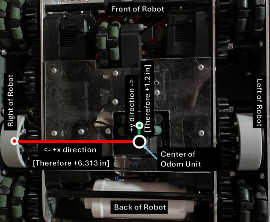
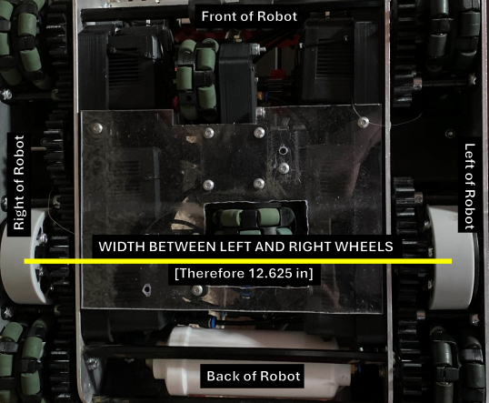

# Configuring Odometry

## Configuring Sensors

I don't like straight-cut tutorials, said *no one ever*. It is time to configure your robot drivetrain,
the most essential part of your robot.

#### Setting Up Controller

Before anything, we need to configure the controller we want to use alongside the mode.

<!-- tabs:start -->

#### **VEXCode & PROS**

```cpp
// Primary controller
WhoopController controller1(joystickmode::joystickmode_tank, controllertype::controller_primary);
```


<!-- tabs:end -->

As you see, we have initialized the primary controller. If you wish to use the second controller, change `controllertype` to ```controllertype::partner```.

There are several joystick modes:

| ```joystickmode```     | Definition | 
|----------|:--------:|
| ```joystickmode_split_arcade```    | Left Joystick Moves Forward/Backward, Right Joystick Turns Left/Right     |
| ```joystickmode_left_arcade```    | Left Joystick Moves Forward/Backward and Turns Left/Right     |
| ```joystickmode_right_arcade```    | Right Joystick Moves Forward/Backward and Turns Left/Right     |
| ```joystickmode_tank```    | Left Joystick Moves Left Side of Drive, Right Joystick Moves Right Side of Drive     |

Next step is configuring the motors and drive groups using WhoopMotors

#### Setting Up Motors

<!-- tabs:start -->

#### **VEXCode & PROS**

```cpp
// Left drive motors
WhoopMotor l1(PORT12, cartridge::blue, reversed::no_reverse);
WhoopMotor l2(PORT13, cartridge::blue, reversed::no_reverse);
WhoopMotor l3(PORT14, cartridge::blue, reversed::no_reverse);
WhoopMotor l4(PORT15, cartridge::blue, reversed::no_reverse);
WhoopMotorGroup left_motors({&l1, &l2, &l3, &l4});

// Right drive motors
WhoopMotor r1(PORT1, cartridge::blue, reversed::yes_reverse);
WhoopMotor r2(PORT2, cartridge::blue, reversed::yes_reverse);
WhoopMotor r3(PORT3, cartridge::blue, reversed::yes_reverse);
WhoopMotor r4(PORT4, cartridge::blue, reversed::yes_reverse);
WhoopMotorGroup right_motors({&r1, &r2, &r3, &r4});
```

<!-- tabs:end -->


PORT1 is well... Port 1 on the V5 Brain. You can assume the rest for ports 1 through 21.

Most of this is self-explanatory. However, just for the sake of it:

Gear Setting Options:

| ```cartridge```     | Definition | 
|----------|:--------:|
| ```blue```    | Blue cartridge (600 RPM)     |
| ```green```    | Green cartridge (200 RPM)    |
| ```red```    | Red cartridge (100 RPM)    |

Reverse options

| ```reversed```     | Definition | 
|----------|:--------:|
| ```no_reverse```    | Clockwise-Positive (Direction of the arrow printed on the back of the motor)     |
| ```yes_reverse```    | Counter-Clockwise-Positive     |

Next, we want to configure an inertial sensor and additional sensors that we plan to use for the drivetrain

#### Setting Up Additional Sensors

You are pretty much required to have an inertial sensor with the robot.

<!-- tabs:start -->

#### **VEXCode & PROS**

```cpp
WhoopInertial inertial_sensor(PORT7);
```

<!-- tabs:end -->


Skadoosh

However, forward and sideways trackers are recommended (but optional). These are rotation sensors (encoders are not supported for the meantime):

<!-- tabs:start -->

#### **VEXCode & PROS**

```cpp
WhoopRotation forward_tracker(PORT6, reversed::yes_reverse);
WhoopRotation sideways_tracker(PORT9, reversed::yes_reverse);
```

<!-- tabs:end -->

The forward tracker is the tracker that tracks forwards/backwards movement of the robot, while the sideways tracker is the tracker that tracks sideways movement of the robot.

## Configuring Odometry

Now we are ready for the nitty-gritty. It is time to setup the odometry unit. There are three configurations (pick one):

<!-- tabs:start -->

#### **Configure With Two Trackers**


The following illustration shows the center of the odometry unit. The odom unit center is the virtual intercept of the perpendicular faces of the odometry trackers. The measurements is from the center of the odom unit to the designated tracker distances.

The forward tracker is always offset right/left from the center of the odometry unit center, while the sideways tracker is always forward/backwards from the center of the odometry unit. The measurements are in **meters**. If you measured in inches, you can wrap it with ```to_meters(inches)``` and it would be converted to meters.

Based upon the following illustration above, with ```2.5189``` inch wheels, the forward tracker being offset to the right, and sideways tracker being offset back of the odometry unit:

<!-- tabs:start -->

#### **VEXCode & PROS**

```cpp
WhoopDriveOdomUnit odom_unit(
    to_meters(1.51),   // The forward tracker distance, in meters, from the odom unit's center. (positive implies a shift to the right from the odom unit's center)
    to_meters(2.5189), // Diameter of the forward tracker, in meters (e.g., 0.08255 for 3.25-inch wheels).
    to_meters(-4.468), // The sideways tracker distance, in meters, from the odom unit's center (positive implies a shift forward from the odom unit center)
    to_meters(2.5189), // Diameter of the sideways tracker, in meters (e.g., 0.08255 for 3.25-inch wheels).
    &inertial_sensor,  // Pointer to the WhoopInertial sensor
    &forward_tracker,  // Pointer to the forward tracker, as a WhoopRotation sensor
    &sideways_tracker  // Pointer to the sideways tracker, as a WhoopRotation sensor
);
```

<!-- tabs:end -->


Next is to configure an offset of the odometry unit's center to the center of the robot:


The black dot is the center of the odometry unit, while the purple dot is the center of the robot. Keep in mind that traction wheels **will** shift the center of the robot towards the traction wheels.

Based upon the image, the odometry offset would be:

<!-- tabs:start -->

#### **VEXCode & PROS**

```cpp
WhoopDriveOdomOffset odom_offset(
  &odom_unit,      // Pointer to the odometry unit (will manage the odom unit)
  to_meters(-0.6), // The x offset of the odom unit from the center of the robot (positive implies a shift right from the center of the robot).
  to_meters(4.95)  // The y offset of the odom unit from the center of the robot (positive implies a shift forward from the center of the robot).
);
```

<!-- tabs:end -->

NOTE: If your Odom Unit's Center IS the center of the robot, set to ```0``` and ```0```.

#### **Configure With One Tracker**



For this, you assume that the right wheels is the forwards tracker.

<!-- tabs:start -->

#### **VEXCode & PROS**

```cpp
WhoopDriveOdomUnit odom_unit(
  to_meters(6.313),  // Distance between the center of the odom unit and the right wheels, in meters.
  to_meters(3),      // Diameter of drivetrain wheels, in meters 
  1.0/2.0,           // Gear Ratio of Drivetrain (If [motor is powering 32t] connected to [64t sharing shaft with drive wheel], it would be ratio = 32/64 = 1.0/2.0) 
  to_meters(1.2),    // Sideways tracker distance from the center of the robot's rotation. (positive implies a shift forward from the drivetrain's center)
  to_meters(2.5189), // Diameter of the sideways tracker, in meters (e.g., 0.08255 for 3.25-inch wheels).
  &inertial_sensor, 
  &sideways_tracker, 
  &left_motors, 
  &right_motors
);
```

<!-- tabs:end -->


Next is configuring the offsets. Since the forward/backwards location for the wheels is the same as the center of the robot, the forwards/backwards offset would be ```0```.


The black dot is the center of the odometry unit, while the purple dot is the center of the robot. Keep in mind that traction wheels **will** shift the center of the robot towards the traction wheels.

<!-- tabs:start -->

#### **VEXCode & PROS**

```cpp

WhoopDriveOdomOffset odom_offset(
  &odom_unit,      // Pointer to the odometry unit (will manage the odom unit)
  to_meters(-0.6), // The x offset of the odom unit from the center of the robot (positive implies a shift right from the center of the robot).
  to_meters(0)     // Zero as one-tracker odom has no y-offset from the center of the robot
);
```

<!-- tabs:end -->


#### **Configure With No Tracker**



If you are not using any trackers, this is very clear-cut.


<!-- tabs:start -->

#### **VEXCode & PROS**

```cpp
WhoopDriveOdomUnit odom_unit(
  to_meters(12.625), // Width of the drivetrain, in meters. Measured as the distance between the left wheels and right wheels
  to_meters(3),      // Diameter of drivetrain wheels, in meters 
  1.0/2.0,           // Gear Ratio of Drivetrain (If [motor is powering 32t] connected to [64t sharing shaft with drive wheel], it would be ratio = 32/64 = 1.0/2.0) 
  &inertial_sensor, 
  &left_motors, 
  &right_motors
);
```

<!-- tabs:end -->


And then configure offset

<!-- tabs:start -->

#### **VEXCode & PROS**

```cpp
WhoopDriveOdomOffset odom_offset(
  &odom_unit,   // Pointer to the odometry unit (will manage the odom unit)
  to_meters(0), // Zero offset as no tracker
  to_meters(0)  // Zero offset as no tracker
);
```

<!-- tabs:end -->

<!-- tabs:end -->

Now you are ready to continue to the next step!
