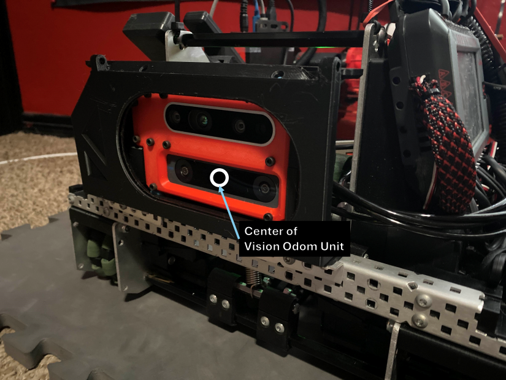
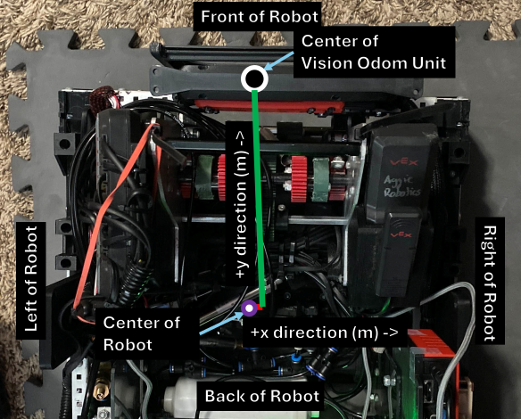

# Configuring Vision Odometry

The Vision Odometry Requires the Whooplib Tesseract and the Whooplib OS installed. 

<!-- tabs:start -->

#### **If You Have a Vision Tesseract**


## Jetson Nano Pretense

As soon as the Jetson Nano receives power, it immediately boots up. Make sure that the OS is updated to the latest version before continuing the following steps.

The order sheet for these items and 3D models can be found here: [WhoopLib Vision Hardware](WhoopLibVisionHardware/README.md)

To install the Vision Software and **Update To the Latest Version** on the Jetson Nano: [WhoopLib Vision OS Install](WhoopLibVisionInstall/README.md)

---

## Configuring Communication Protol

In order to create the communication protocol, create the buffer_system object:

<!-- tabs:start -->

#### **VEXCode & PROS**

```cpp
// Serial communication module
BufferNode buffer_system(
    256,                       // The buffer size, in characters. Increase if necessary, but at the cost of computational efficiency.
    debugmode::debug_disabled, // debugmode::debug_disabled for competition use, debugmode::debug_enabled to allow the code to pass errors through
); 
```

<!-- tabs:end -->

The buffer size is ```256```. That means that all incoming messages together may not exceed ```256``` characters. If it does, increase this size, but at the expense of computational cost.

Set ```debugmode::debug_disabled``` at all times, unless you are trying to troubleshoot something. If you are trying to troubleshoot the connection, set ```debugmode::debug_enabled``` to allow errors to pass through.

Next, we establish an offset from the center of the robot. The vision system must face the front of the robot, just to simplify the library.

## Creating the Vision System Object

#### Establishing Offsets

The center of the vision tesseract is located at the center of the T265 camera



With this information, we will determine the necessary offsets of the camera from the center of the robot:



<!-- tabs:start -->

#### **VEXCode & PROS**

```cpp
// Vision Offset of the Vision Tesseract from the Center of Robot
RobotVisionOffset vision_offset(
  to_meters(0.21), // The x offset in meters, (right-positive from the center of the robot).
  to_meters(8.66); // The y offset in meters (forward-positive from the center of the robot).
);
```

<!-- tabs:end -->


Then, we create the vision system object and subscribe to the stream ```"P"``` for Pose (which was configured jetson-nano side, by default).

<!-- tabs:start -->

#### **VEXCode & PROS**

```cpp
// Jetson Nano pose retreival object (also configured on Nano-side) 
WhoopVision vision_system(
    &vision_offset, // pointer to the vision offset
    &buffer_system, // Pointer to the buffer system (will be managed by the buffer system)
    "P"             // The subscribed stream name to receive the pose from the Jetson Nano
);
```

<!-- tabs:end -->


Next, we want to create a jetson commander so that the robot can communicate when it is idling or not

<!-- tabs:start -->

#### **VEXCode & PROS**

```cpp
// This is the jetson commander. It sends keep-alive messages intermittently and also allows
// Running the following functions (can be a touch screen confirmation button perhaps):
// jetson_commander.shutdown_jetson();
// jetson_commander.reboot_jetson();
// jetson_commander.restart_vision_process();
// bool is_connected_currently = jetson_commander.is_connected_to_jetson();
// This is essential to ensure that the nano starts its internal program, stop program, restarts program, 
// and can be told to reboot or shutdown
JetsonCommander jetson_commander(
    &controller1,                      // The controller to send messages to upon error
    &buffer_system,                    // Pointer to the buffer system (will be managed by the buffer system)
    "C",                               // The subscribed stream name for keep-alive, shutdown, and reboot
    60,                                // In seconds. When the V5 Brain shuts down or disconnects, the Jetson Nano will keep the program running for this time before it shuts off
    2,                                 // How many seconds to wait before sending anoter keep alive message to Jetson (suggested 2)
    jetsonCommunication::disable_comms // If you don't have a Vision Tesseract on your robot, set to disable_comms
);
```

<!-- tabs:end -->

Okay this seems like quite a bit but take a deep breath we will get through this.

```"C"``` is for Communication stream, which was also configured jetson-side. This stream is where the robot communicates "Hey, I'm here" pretty much to the Jetson Nano. And the number after, ```60```, is how many seconds to be kept alive. If the Jetson Nano does not receive any message after that time, it enters the idle state to be more battery efficient. The ```2``` is the step time for keep-alive. So it would say "Hey, I'm here" every ```2``` seconds upon robot code start.

There are two modes for ```jetsonCommunication```:

| ```jetsonCommunication```     | Definition | 
|----------|:--------:|
| ```enable_comms```    | Allow status messages to be pushed to a designated controller for any important information of the Jetson Nano     |
| ```disable_comms```    | Mute important notifications about the Jetson Nano     |

Now, you are ready to fuse the odometry! Proceed to the next step.

#### **If You Do Not Have a Vision Tesseract**

#### If you do not wish to use vision odometry with Jetson Nano, skip this step and move on to:  [Configuring Odometry Fusion](ConfiguringOdomFusion/README.md)

<!-- tabs:end -->
