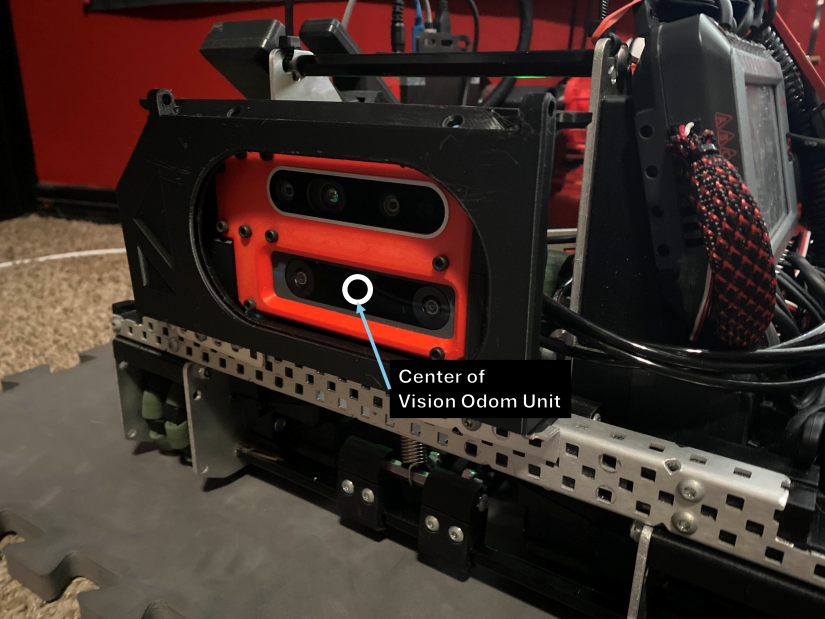
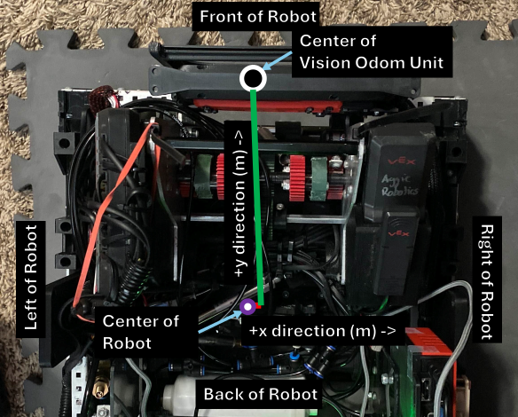

# Configuring Vision Odometry

The Vision Odometry Requires the Whooplib Tesseract and the Whooplib OS installed. 

<!-- tabs:start -->

#### **If You Have a Vision Tesseract**


## Jetson Nano Pretense

As soon as the Jetson Nano receives power, it immediately boots up. Make sure that the OS is updated to the latest version before continuing the following steps.

The order sheet for these items and 3D models can be found here: [WhoopLib Vision Hardware](WhoopLibVisionHardware/README.md)

To install the Vision Software and **Update To the Latest Version** on the Jetson Nano: [WhoopLib Vision OS Install](WhoopLibVisionInstall/README.md)

---

## Configuring Communication Protol

In order to create the communication protocol, create the buffer_system object:

<!-- tabs:start -->

#### **VEXCode & PROS**

```cpp
// Serial communication module
BufferNode buffer_system(
    256,                       // The buffer size, in characters. Increase if necessary, but at the cost of computational efficiency.
    debugmode::debug_disabled, // debugmode::debug_disabled for competition use, debugmode::debug_enabled to allow the code to pass errors through
); 
```

<!-- tabs:end -->

The buffer size is ```256```. That means that all incoming messages together may not exceed ```256``` characters. If it does, increase this size, but at the expense of computational cost.

Set ```debugmode::debug_disabled``` at all times, unless you are trying to troubleshoot something. If you are trying to troubleshoot the connection, set ```debugmode::debug_enabled``` to allow errors to pass through.

Next, we establish an offset from the center of the robot. The vision system must face the front of the robot, just to simplify the library.

## Creating the Vision System Object

#### Establishing Offsets

The center of the vision tesseract is located at the center of the T265 camera



With this information, we will determine the necessary offsets of the camera from the center of the robot:



<!-- tabs:start -->

#### **VEXCode & PROS**

```cpp
// Vision Offset of the Vision Tesseract from the Center of Robot
RobotVisionOffset vision_offset(
  0.21_in, // The x offset (right-positive from the center of the robot).
  8.66_in; // The y offset (forward-positive from the center of the robot).
);
```

<!-- tabs:end -->


Then, we create the vision system object and subscribe to the stream ```"P"``` for Pose (which was configured jetson-nano side, by default).

<!-- tabs:start -->

#### **VEXCode & PROS**

```cpp
// Jetson Nano pose retreival object (also configured on Nano-side) 
WhoopVision vision_system(
    &vision_offset, // pointer to the vision offset
    &buffer_system, // Pointer to the buffer system (will be managed by the buffer system)
    "P"             // The subscribed stream name to receive the pose from the Jetson Nano
);
```

<!-- tabs:end -->


Next, we want to create a jetson commander so that the robot can communicate when it is idling or not

<!-- tabs:start -->

#### **VEXCode & PROS**

```cpp
// This is the jetson commander. It sends keep-alive messages intermittently and also allows
// Running the following functions (can be a touch screen confirmation button perhaps):
// jetson_commander.shutdown_jetson();
// jetson_commander.reboot_jetson();
// jetson_commander.restart_vision_process();
// bool is_connected_currently = jetson_commander.is_connected_to_jetson();
// This is essential to ensure that the nano starts its internal program, stop program, restarts program, 
// and can be told to reboot or shutdown
JetsonCommander jetson_commander(
    &controller1,                       // The controller to send messages to upon error
    &buffer_system,                     // Pointer to the buffer system (will be managed by the buffer system)
    "C",                                // The subscribed stream name for keep-alive, shutdown, and reboot
    60_sec,                             // In seconds. When the V5 Brain shuts down or disconnects, the Jetson Nano will keep the program running for this time before it shuts off
    2_sec,                              // How many seconds to wait before sending anoter keep alive message to Jetson (suggested 2)
    jetsonCommunication::disable_comms  // If you don't have a Vision Tesseract on your robot, set to disable_comms
);
```

<!-- tabs:end -->

Okay this seems like quite a bit but take a deep breath we will get through this.

```"C"``` is for Communication stream, which was also configured jetson-side. This stream is where the robot communicates "Hey, I'm here" pretty much to the Jetson Nano. And the number after, ```60```, is how many seconds to be kept alive. If the Jetson Nano does not receive any message after that time, it enters the idle state to be more battery efficient. The ```2``` is the step time for keep-alive. So it would say "Hey, I'm here" every ```2``` seconds upon robot code start.

There are two modes for ```jetsonCommunication```:

| ```jetsonCommunication```     | Definition | 
|----------|:--------:|
| ```enable_comms```    | Allow status messages to be pushed to a designated controller for any important information of the Jetson Nano     |
| ```disable_comms```    | Mute important notifications about the Jetson Nano     |

If you are struggling, here is full example codeusing the odometry vision system with fusion:

<!-- tabs:start -->
#### **Examples**

Look at the other tabs to view full applied examples of the vision system applied.

#### **Applied: PROS**

```cpp
/**
 * Module:       main.cpp
 * Author:       Connor White   
 * Created:      Thu Jun 21 2024
 * Description:  Whooplib Template
 *
 * Contributions:
 *   2775 Josh:
 *      https://github.com/JacksonAreaRobotics/JAR-Template
 *   Intel:
 *      https://github.com/IntelRealSense/librealsense
 *   PiLons:
 *      http://thepilons.ca/wp-content/uploads/2018/10/Tracking.pdf
 *   Andrew Walker:
 *      https://github.com/AndrewWalker/Dubins-Curves/tree/master
 *   Alex:
 *      https://www.learncpp.com/
 *
 */
#include "main.h"

////////////////////////////////////////////////////////////
/**
 *    Globals
 */
////////////////////////////////////////////////////////////

// Primary controller
WhoopController controller1(joystickmode::joystickmode_split_arcade, controllertype::controller_primary);

// Left drive motors
WhoopMotor l1(PORT12, cartridge::blue, reversed::yes_reverse);
WhoopMotor l2(PORT13, cartridge::blue, reversed::yes_reverse);
WhoopMotor l3(PORT14, cartridge::blue, reversed::yes_reverse);
WhoopMotor l4(PORT15, cartridge::blue, reversed::yes_reverse);
WhoopMotorGroup left_motors({&l1, &l2, &l3, &l4});

// Right drive motors
WhoopMotor r1(PORT1, cartridge::blue, reversed::no_reverse);
WhoopMotor r2(PORT2, cartridge::blue, reversed::no_reverse);
WhoopMotor r3(PORT3, cartridge::blue, reversed::no_reverse);
WhoopMotor r4(PORT4, cartridge::blue, reversed::no_reverse);
WhoopMotorGroup right_motors({&r1, &r2, &r3, &r4});

// Sensors
WhoopInertial inertial_sensor(PORT7);
WhoopRotation forward_tracker(PORT6, reversed::no_reverse);
WhoopRotation sideways_tracker(PORT9, reversed::no_reverse);

// ////////////////////////////////////////////////////////////
// /**
//  *    Wheel Odometry Configuration
//  */
// ////////////////////////////////////////////////////////////

WhoopDriveOdomUnit odom_unit(
    1.51_in,          // The forward tracker distance from the odom unit's center. (positive implies a shift to the right from the odom unit's center)
    2.5189_in,        // Diameter of the forward tracker (e.g., 3.25_in for 3.25-inch wheels).
    -4.468_in,        // The sideways tracker distance from the odom unit's center (positive implies a shift forward from the odom unit center)
    2.5189_in,        // Diameter of the sideways tracker (e.g., 3.25_in for 3.25-inch wheels).
    &inertial_sensor, // Pointer to the WhoopInertial sensor
    &forward_tracker, // Pointer to the forward tracker, as a WhoopRotation sensor
    &sideways_tracker // Pointer to the sideways tracker, as a WhoopRotation sensor
);

WhoopDriveOdomOffset odom_offset(
    &odom_unit, // Pointer to the odometry unit (will manage the odom unit)
    -0.6_in,    // The x offset of the odom unit from the center of the robot (positive implies a shift right from the center of the robot).
    4.95_in     // The y offset of the odom unit from the center of the robot (positive implies a shift forward from the center of the robot).
);

// ////////////////////////////////////////////////////////////
// /**
//  *    VISION TESSERACT
//  */
// ////////////////////////////////////////////////////////////

// Serial communication module
BufferNode buffer_system(
    256,                      // The buffer size, in characters. Increase if necessary, but at the cost of computational efficiency.
    debugmode::debug_disabled // debugMode::debug_disabled for competition use, debugMode::debug_enabled to allow the code to pass errors through
);

// Vision Offset of the Vision Tesseract from the Center of Robot
RobotVisionOffset vision_offset(
    0_mm,  // The x offset (right-positive from the center of the robot).
    220_mm // The y offset (forward-positive from the center of the robot).
);

// Jetson Nano pose retreival object (also configured on Nano-side)
WhoopVision vision_system(
    &vision_offset, // pointer to the vision offset
    &buffer_system, // Pointer to the buffer system (will be managed by the buffer system)
    "P"             // The subscribed stream name to receive the pose from the Jetson Nano
);

// This is the jetson commander. It sends keep-alive messages intermittently and also commands the Jetson Nano.
// This is essential to ensure that the nano starts its internal program, stop program, restarts program,
// and can be told to reboot or shutdown.
JetsonCommander jetson_commander(
    &controller1,                      // The controller to send messages to upon error
    &buffer_system,                    // Pointer to the buffer system (will be managed by the buffer system)
    "C",                               // The subscribed stream name for keep-alive, shutdown, and reboot
    60_sec,                            // In seconds. When the V5 Brain shuts down or disconnects, the Jetson Nano will keep the program running for this time before it shuts off
    2_sec,                             // How many seconds to wait before sending anoter keep alive message to Jetson (suggested 2)
    jetsonCommunication::disable_comms // If you don't have a Vision Tesseract on your robot, set to disable_comms
);

////////////////////////////////////////////////////////////
/**
 *    Vision x Wheel Odometry Fusion
 */
////////////////////////////////////////////////////////////
WhoopOdomFusion odom_fusion(
    &vision_system,              // Pointer to the vision system
    &odom_offset,                // Pointer to the odometry offset
    0.9,                         // Minimum confidence threshold to apply vision system to odometry
    fusionmode::wheel_odom_only, // The method of fusing
    50_in,                       // If FusionMode is fusion_gradual, it is the maximum allowable lateral shift the vision camera can update per second.
    500_deg                      // If FusionMode is fusion_gradual, it is the maximum allowable yaw rotational shift the vision camera can update per second.
);

////////////////////////////////////////////////////////////
/**
 *    Pure Pursuit Default Parameters
 */
////////////////////////////////////////////////////////////

PursuitParams pursuit_parameters(
    /////////////////////////
    // Path Generation
    /////////////////////////
    // Radius of the turns
    5_in 

    /////////////////////////
    // Pure Pursuit
    /////////////////////////
    // Pure Pursuit look ahead distance
    ,5_in
    // The number of points when generating the path. More points mean higher detail of the path, but at a higher computational cost
    ,100_points 

    /////////////////////////
    // Motor Voltages
    /////////////////////////
    // Pure pursuit forward max motor voltage (0.0, 12.0]
    ,8.0_volts
    // Pure pursuit turning max motor voltage (0.0, 12.0]
    ,12.0_volts

    /////////////////////////
    // Settling
    /////////////////////////
    // Settle Distance. Exits when within this distance of target
    ,1.25_in
    // Settle Rotation. Exits when within this rotation of target
    ,1.1_deg
    // Minimum time to be considered settled, in seconds
    ,0.0_sec
    // Time after which to give up and move on, in seconds (set to 0 to disable)
    ,0_sec
    
    /////////////////////////
    // Turning PID
    /////////////////////////
    // Turning (kP) Proportional Tuning
    ,14_kp
    // Turning (kI) Integral Tuning
    ,0.2_ki
    // Turning (kD) Derivative Tuning
    ,95.0_kd
    // Turning (kR) Integral anti-windup Tuning. Higher value implies greater anti-windup near error=0. 
    // NOTE: Affected by turning_i_activation
    ,1.0_kr
    // The rotation distance (error) to activate turning_ki
    ,20.0_deg
    // The maximum turning voltage change per second, as a slew rate
    ,250.0_volts

    /////////////////////////
    // Forward PID
    /////////////////////////
    // Forward (kP) Proportional Tuning
    ,50.0_kp
    // Forward (kI) Integral Tuning
    ,0.1_ki
    // Forward (kD) Derivative Tuning
    ,250.0_kd
    // Forward (kR) Integral anti-windup Tuning. Higher value implies greater anti-windup near error=0. 
    // NOTE: Affected by forward_i_activation
    ,0.0_kr
    // The forward distance (error) to activate forward_ki
    ,2.0_in
    // The maximum forward voltage change per second, as a slew rate
    ,150.0_volts
);

////////////////////////////////////////////////////////////
/**
 *    Robot Drivetrain and Manager
 */
////////////////////////////////////////////////////////////
WhoopDrivetrain robot_drivetrain(
    &pursuit_parameters,  // The default pure pursuit parameters for operating the robot in autonomous
    &odom_fusion,         // Odometry fusion module
    PoseUnits::in_deg_cw, // Set default pose units if not defined. "m_deg_cw" means "meters, degrees, clockwise-positive yaw", "in_deg_ccw" means "inches, degrees, counter-clockwise-positive yaw", and so forth.
    &controller1,         // Pointer to the controller
    &left_motors,         // Pointer to the left motor group (optionally can be a list of motors as well)
    &right_motors         // Pointer to the right motor group (optionally can be a list of motors as well)
);

/**
 * My first autonomous routine
 */
void auton_1(){
    robot_drivetrain.set_pose_units(PoseUnits::in_deg_cw);
    robot_drivetrain.set_pose(0, 0, 0);

    // robot_drivetrain.turn_to_position(15, 15);
    robot_drivetrain.drive_forward(15);

    robot_drivetrain.turn_to(90);

    robot_drivetrain.drive_forward(-15);

    robot_drivetrain.drive_forward(15);

    robot_drivetrain.turn_to(0);

    robot_drivetrain.drive_forward(-15);

    // robot_drivetrain.drive_to_point(15, 15);
    // robot_drivetrain.reverse_to_point(0,0);
    robot_drivetrain.drive_through_path({{15, 15, 0}, {0, 0, 90}}, 7);
    robot_drivetrain.reverse_through_path({{15, 15, 180}, {0, 0, 180}}, 7);
}

/**
 * My second autonomous routine
 */
void auton_2(){

}

/**
 * My third autonomous routine
 */
void auton_3(){

}

WhoopAutonSelector auton_selector(&controller1, {
    AutonRoutine("First Auton", auton_1),
    AutonRoutine("Second Auton", auton_2),
    AutonRoutine("Third Auton", auton_3)
}, "auton.txt");

ComputeManager manager({&buffer_system, &jetson_commander, &robot_drivetrain, &controller1, &auton_selector});

/**
 * Runs initialization code. This occurs as soon as the program is started.
 *
 * All other competition modes are blocked by initialize; it is recommended
 * to keep execution time for this mode under a few seconds.
 */
void initialize()
{
    auton_selector.run_selector();
    controller1.notify("Initializing");
    manager.start();
}

/**
 * Runs while the robot is in the disabled state of Field Management System or
 * the VEX Competition Switch, following either autonomous or opcontrol. When
 * the robot is enabled, this task will exit.
 */
void disabled()
{
    robot_drivetrain.set_state(drivetrainState::mode_disabled);
}

/**
 * Runs after initialize(), and before autonomous when connected to the Field
 * Management System or the VEX Competition Switch. This is intended for
 * competition-specific initialization routines, such as an autonomous selector
 * on the LCD.
 *
 * This task will exit when the robot is enabled and autonomous or opcontrol
 * starts.
 */
void competition_initialize() {}

/**
 * Runs the user autonomous code. This function will be started in its own task
 * with the default priority and stack size whenever the robot is enabled via
 * the Field Management System or the VEX Competition Switch in the autonomous
 * mode. Alternatively, this function may be called in initialize or opcontrol
 * for non-competition testing purposes.
 *
 * If the robot is disabled or communications is lost, the autonomous task
 * will be stopped. Re-enabling the robot will restart the task, not re-start it
 * from where it left off.
 */
void autonomous()
{
    robot_drivetrain.set_state(drivetrainState::mode_autonomous);
    auton_selector.run_autonomous();
}

/**
 * Runs the operator control code. This function will be started in its own task
 * with the default priority and stack size whenever the robot is enabled via
 * the Field Management System or the VEX Competition Switch in the operator
 * control mode.
 *
 * If no competition control is connected, this function will run immediately
 * following initialize().
 *
 * If the robot is disabled or communications is lost, the
 * operator control task will be stopped. Re-enabling the robot will restart the
 * task, not resume it from where it left off.
 */
void opcontrol()
{
    robot_drivetrain.set_state(drivetrainState::mode_usercontrol);
    
    while (true)
    {
        pros::delay(20); // Run for 20 ms then update
    }
}
```

#### **Applied: VEXCode**

```cpp
/*----------------------------------------------------------------------------*/
/*                                                                            */
/*    Module:       main.cpp                                                  */
/*    Author:       Connor White                                              */
/*    Created:      Thu Jun 21 2024                                           */
/*    Description:  Whooplib Template                                         */
/*                                                                            */
/*    Contributions:                                                          */
/*      2775 Josh:                                                            */
/*        https://github.com/JacksonAreaRobotics/JAR-Template                 */
/*      Intel:                                                                */
/*        https://github.com/IntelRealSense/librealsense                      */
/*      PiLons:                                                               */
/*        http://thepilons.ca/wp-content/uploads/2018/10/Tracking.pdf         */
/*      Andrew Walker:                                                        */
/*        https://github.com/AndrewWalker/Dubins-Curves/tree/master           */
/*      Alex:                                                                 */
/*        https://www.learncpp.com/                                           */
/*                                                                            */
/*----------------------------------------------------------------------------*/
#include "vex.h"
#include "whooplib.h"

using namespace vex;

// A global instance of competition
competition Competition;

////////////////////////////////////////////////////////////
/**
 *    Globals
 */
////////////////////////////////////////////////////////////

// Primary controller
WhoopController controller1(joystickmode::joystickmode_split_arcade, controllertype::controller_primary);

// Left drive motors
WhoopMotor l1(PORT12, cartridge::blue, reversed::yes_reverse);
WhoopMotor l2(PORT13, cartridge::blue, reversed::yes_reverse);
WhoopMotor l3(PORT14, cartridge::blue, reversed::yes_reverse);
WhoopMotor l4(PORT15, cartridge::blue, reversed::yes_reverse);
WhoopMotorGroup left_motors({&l1, &l2, &l3, &l4});

// Right drive motors
WhoopMotor r1(PORT1, cartridge::blue, reversed::no_reverse);
WhoopMotor r2(PORT2, cartridge::blue, reversed::no_reverse);
WhoopMotor r3(PORT3, cartridge::blue, reversed::no_reverse);
WhoopMotor r4(PORT4, cartridge::blue, reversed::no_reverse);
WhoopMotorGroup right_motors({&r1, &r2, &r3, &r4});

// Sensors
WhoopInertial inertial_sensor(PORT7);
WhoopRotation forward_tracker(PORT6, reversed::no_reverse);
WhoopRotation sideways_tracker(PORT9, reversed::no_reverse);

// ////////////////////////////////////////////////////////////
// /**
//  *    Wheel Odometry Configuration
//  */
// ////////////////////////////////////////////////////////////

WhoopDriveOdomUnit odom_unit(
    1.51_in,          // The forward tracker distance from the odom unit's center. (positive implies a shift to the right from the odom unit's center)
    2.5189_in,        // Diameter of the forward tracker (e.g., 3.25_in for 3.25-inch wheels).
    -4.468_in,        // The sideways tracker distance from the odom unit's center (positive implies a shift forward from the odom unit center)
    2.5189_in,        // Diameter of the sideways tracker (e.g., 3.25_in for 3.25-inch wheels).
    &inertial_sensor, // Pointer to the WhoopInertial sensor
    &forward_tracker, // Pointer to the forward tracker, as a WhoopRotation sensor
    &sideways_tracker // Pointer to the sideways tracker, as a WhoopRotation sensor
);

WhoopDriveOdomOffset odom_offset(
    &odom_unit, // Pointer to the odometry unit (will manage the odom unit)
    -0.6_in,    // The x offset of the odom unit from the center of the robot (positive implies a shift right from the center of the robot).
    4.95_in     // The y offset of the odom unit from the center of the robot (positive implies a shift forward from the center of the robot).
);

// ////////////////////////////////////////////////////////////
// /**
//  *    VISION TESSERACT
//  */
// ////////////////////////////////////////////////////////////

// Serial communication module
BufferNode buffer_system(
    256,                      // The buffer size, in characters. Increase if necessary, but at the cost of computational efficiency.
    debugmode::debug_disabled // debugMode::debug_disabled for competition use, debugMode::debug_enabled to allow the code to pass errors through
);

// Vision Offset of the Vision Tesseract from the Center of Robot
RobotVisionOffset vision_offset(
    0_mm,  // The x offset (right-positive from the center of the robot).
    220_mm // The y offset (forward-positive from the center of the robot).
);

// Jetson Nano pose retreival object (also configured on Nano-side)
WhoopVision vision_system(
    &vision_offset, // pointer to the vision offset
    &buffer_system, // Pointer to the buffer system (will be managed by the buffer system)
    "P"             // The subscribed stream name to receive the pose from the Jetson Nano
);

// This is the jetson commander. It sends keep-alive messages intermittently and also commands the Jetson Nano.
// This is essential to ensure that the nano starts its internal program, stop program, restarts program,
// and can be told to reboot or shutdown.
JetsonCommander jetson_commander(
    &controller1,                      // The controller to send messages to upon error
    &buffer_system,                    // Pointer to the buffer system (will be managed by the buffer system)
    "C",                               // The subscribed stream name for keep-alive, shutdown, and reboot
    60_sec,                            // In seconds. When the V5 Brain shuts down or disconnects, the Jetson Nano will keep the program running for this time before it shuts off
    2_sec,                             // How many seconds to wait before sending anoter keep alive message to Jetson (suggested 2)
    jetsonCommunication::disable_comms // If you don't have a Vision Tesseract on your robot, set to disable_comms
);

////////////////////////////////////////////////////////////
/**
 *    Vision x Wheel Odometry Fusion
 */
////////////////////////////////////////////////////////////
WhoopOdomFusion odom_fusion(
    &vision_system,              // Pointer to the vision system
    &odom_offset,                // Pointer to the odometry offset
    0.9,                         // Minimum confidence threshold to apply vision system to odometry
    fusionmode::wheel_odom_only, // The method of fusing
    50_in,                       // If FusionMode is fusion_gradual, it is the maximum allowable lateral shift the vision camera can update per second.
    500_deg                      // If FusionMode is fusion_gradual, it is the maximum allowable yaw rotational shift the vision camera can update per second.
);

////////////////////////////////////////////////////////////
/**
 *    Pure Pursuit Default Parameters
 */
////////////////////////////////////////////////////////////

PursuitParams pursuit_parameters(
    /////////////////////////
    // Path Generation
    /////////////////////////
    // Radius of the turns
    5_in 

    /////////////////////////
    // Pure Pursuit
    /////////////////////////
    // Pure Pursuit look ahead distance
    ,5_in
    // The number of points when generating the path. More points mean higher detail of the path, but at a higher computational cost
    ,100_points 

    /////////////////////////
    // Motor Voltages
    /////////////////////////
    // Pure pursuit forward max motor voltage (0.0, 12.0]
    ,8.0_volts
    // Pure pursuit turning max motor voltage (0.0, 12.0]
    ,12.0_volts

    /////////////////////////
    // Settling
    /////////////////////////
    // Settle Distance. Exits when within this distance of target
    ,1.25_in
    // Settle Rotation. Exits when within this rotation of target
    ,1.1_deg
    // Minimum time to be considered settled, in seconds
    ,0.0_sec
    // Time after which to give up and move on, in seconds (set to 0 to disable)
    ,0_sec
    
    /////////////////////////
    // Turning PID
    /////////////////////////
    // Turning (kP) Proportional Tuning
    ,14_kp
    // Turning (kI) Integral Tuning
    ,0.2_ki
    // Turning (kD) Derivative Tuning
    ,95.0_kd
    // Turning (kR) Integral anti-windup Tuning. Higher value implies greater anti-windup near error=0. 
    // NOTE: Affected by turning_i_activation
    ,1.0_kr
    // The rotation distance (error) to activate turning_ki
    ,20.0_deg
    // The maximum turning voltage change per second, as a slew rate
    ,250.0_volts

    /////////////////////////
    // Forward PID
    /////////////////////////
    // Forward (kP) Proportional Tuning
    ,50.0_kp
    // Forward (kI) Integral Tuning
    ,0.1_ki
    // Forward (kD) Derivative Tuning
    ,250.0_kd
    // Forward (kR) Integral anti-windup Tuning. Higher value implies greater anti-windup near error=0. 
    // NOTE: Affected by forward_i_activation
    ,0.0_kr
    // The forward distance (error) to activate forward_ki
    ,2.0_in
    // The maximum forward voltage change per second, as a slew rate
    ,150.0_volts
);

////////////////////////////////////////////////////////////
/**
 *    Robot Drivetrain and Manager
 */
////////////////////////////////////////////////////////////
WhoopDrivetrain robot_drivetrain(
    &pursuit_parameters,  // The default pure pursuit parameters for operating the robot in autonomous
    &odom_fusion,         // Odometry fusion module
    PoseUnits::in_deg_cw, // Set default pose units if not defined. "m_deg_cw" means "meters, degrees, clockwise-positive yaw", "in_deg_ccw" means "inches, degrees, counter-clockwise-positive yaw", and so forth.
    &controller1,         // Pointer to the controller
    &left_motors,         // Pointer to the left motor group (optionally can be a list of motors as well)
    &right_motors         // Pointer to the right motor group (optionally can be a list of motors as well)
);

/**
 * My first autonomous routine
 */
void auton_1(){
    robot_drivetrain.set_pose_units(PoseUnits::in_deg_cw);
    robot_drivetrain.set_pose(0, 0, 0);

    // robot_drivetrain.turn_to_position(15, 15);
    robot_drivetrain.drive_forward(15);

    robot_drivetrain.turn_to(90);

    robot_drivetrain.drive_forward(-15);

    robot_drivetrain.drive_forward(15);

    robot_drivetrain.turn_to(0);

    robot_drivetrain.drive_forward(-15);

    // robot_drivetrain.drive_to_point(15, 15);
    // robot_drivetrain.reverse_to_point(0,0);
    robot_drivetrain.drive_through_path({{15, 15, 0}, {0, 0, 90}}, 7);
    robot_drivetrain.reverse_through_path({{15, 15, 180}, {0, 0, 180}}, 7);
}

/**
 * My second autonomous routine
 */
void auton_2(){

}

/**
 * My third autonomous routine
 */
void auton_3(){

}

WhoopAutonSelector auton_selector(&controller1, {
    AutonRoutine("First Auton", auton_1),
    AutonRoutine("Second Auton", auton_2),
    AutonRoutine("Third Auton", auton_3)
}, "auton.txt");

ComputeManager manager({&buffer_system, &jetson_commander, &robot_drivetrain, &controller1, &auton_selector});

/*---------------------------------------------------------------------------*/
/*                          Pre-Autonomous Functions                         */
/*                                                                           */
/*  You may want to perform some actions before the competition starts.      */
/*  Do them in the following function.  You must return from this function   */
/*  or the autonomous and usercontrol tasks will not be started.  This       */
/*  function is only called once after the V5 has been powered on and        */
/*  not every time that the robot is disabled.                               */
/*---------------------------------------------------------------------------*/
void pre_auton()
{
    robot_drivetrain.set_state(drivetrainState::mode_disabled);
    auton_selector.run_selector();

    // Initializing Robot Configuration. DO NOT REMOVE!
    vexcodeInit();
    controller1.notify("Initializing");
    manager.start();
}

/*---------------------------------------------------------------------------*/
/*                                                                           */
/*                              Autonomous Task                              */
/*                                                                           */
/*  This task is used to control your robot during the autonomous phase of   */
/*  a VEX Competition.                                                       */
/*                                                                           */
/*  You must modify the code to add your own robot specific commands here.   */
/*---------------------------------------------------------------------------*/

void autonomous()
{
    robot_drivetrain.set_state(drivetrainState::mode_autonomous);
    auton_selector.run_autonomous();
}

/*---------------------------------------------------------------------------*/
/*                                                                           */
/*                              User Control Task                            */
/*                                                                           */
/*  This task is used to control your robot during the user control phase of */
/*  a VEX Competition.                                                       */
/*                                                                           */
/*  You must modify the code to add your own robot specific commands here.   */
/*---------------------------------------------------------------------------*/
void usercontrol()
{
  robot_drivetrain.set_state(drivetrainState::mode_usercontrol);

  // User control code here, inside the loop
  while (true)
  {
    wait(20, msec);
  }
}

//
// Main will set up the competition functions and callbacks.
//
int main()
{
  Competition.autonomous(autonomous);
  Competition.drivercontrol(usercontrol);
  pre_auton();
  while (true)
    wait(100, msec);
}
```

<!-- tabs:end -->

Now, you are ready to fuse the odometry! Proceed to the next step.

#### **If You Do Not Have a Vision Tesseract**

#### If you do not wish to use vision odometry with Jetson Nano, skip this step and move on to:  [Configuring Odometry Fusion](ConfiguringOdomFusion/README.md)

<!-- tabs:end -->