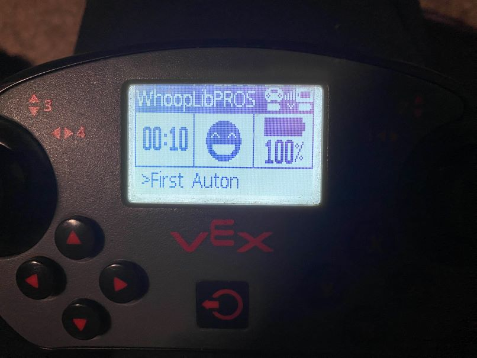

# Creating Auton Selector

Given that we need to have autons, we can create an auton selector object that can be interfaced with a given controller.

Let's assume we have the following autonomous routines:

<!-- tabs:start -->

#### **VEXCode & PROS**

```cpp
/**
 * My first autonomous routine
 */
void auton_1(){
    robot_drivetrain.set_pose_units(PoseUnits::in_deg_cw);
    robot_drivetrain.set_pose(0, 0, 0);

    // robot_drivetrain.turn_to_position(15, 15);
    robot_drivetrain.drive_forward(15);

    robot_drivetrain.turn_to(90);

    robot_drivetrain.drive_forward(-15);

    robot_drivetrain.drive_forward(15);

    robot_drivetrain.turn_to(0);

    robot_drivetrain.drive_forward(-15);

    // robot_drivetrain.drive_to_point(15, 15);
    // robot_drivetrain.reverse_to_point(0,0);
    robot_drivetrain.drive_through_path({{15, 15, 0}, {0, 0, 90}}, 7);
    robot_drivetrain.reverse_through_path({{15, 15, 180}, {0, 0, 180}}, 7);
}

/**
 * My second autonomous routine
 */
void auton_2(){
    robot_drivetrain.set_pose_units(PoseUnits::in_deg_cw);
    robot_drivetrain.set_pose(-30, -10, 0);

    robot_drivetrain.drive_forward(15);

    robot_drivetrain.turn_to(0);

    robot_drivetrain.drive_forward(-15);
}

/**
 * My third autonomous routine
 */
void auton_3(){
    robot_drivetrain.set_pose_units(PoseUnits::in_deg_cw);
    robot_drivetrain.set_pose(25, 0, 0);

    robot_drivetrain.reverse_through_path({{15, 15, 180}, {0, 0, 180}}, 7);
}
```

<!-- tabs:end -->

We can add these auton routines and give them a name via the following:

<!-- tabs:start -->

#### **If you do not want saving to MicroSD**

<!-- tabs:start -->

#### **VEXCode & PROS**

```cpp
WhoopAutonSelector auton_selector(&controller1, {
    AutonRoutine("First Auton", auton_1),
    AutonRoutine("Second Auton", auton_2),
    AutonRoutine("Third Auton", auton_3)
});
```

As you see, we have names like `"First Auton"`. These are the names
that will show on the controller, as a descriptor.

<!-- tabs:end -->

#### **If you want saving to MicroSD**

If you want to save to the MicroSD, you need to designate
a file for saving. You can name it something like `auton.txt`.

Here is an example for doing so:

<!-- tabs:start -->

#### **VEXCode & PROS**
```cpp
WhoopAutonSelector auton_selector(&controller1, {
    AutonRoutine("First Auton", auton_1),
    AutonRoutine("Second Auton", auton_2),
    AutonRoutine("Third Auton", auton_3)
}, "auton.txt");
```

As you see, we have names like `"First Auton"`. These are the names
that will show on the controller, as a descriptor. Additionally,
it will be saved on the Micro SD card as such name as well.

<!-- tabs:end -->

<!-- tabs:end -->


Now that you created an autonomous selector, and binded it to a controller
for selecting, you can now utilize it. To activate the autonomous selector,
you can add the following to `initialize()` in PROS, or `pre_auton()` in
VEXCode:

<!-- tabs:start -->

#### **VEXCode**

```cpp
/*---------------------------------------------------------------------------*/
/*                          Pre-Autonomous Functions                         */
/*                                                                           */
/*  You may want to perform some actions before the competition starts.      */
/*  Do them in the following function.  You must return from this function   */
/*  or the autonomous and usercontrol tasks will not be started.  This       */
/*  function is only called once after the V5 has been powered on and        */
/*  not every time that the robot is disabled.                               */
/*---------------------------------------------------------------------------*/
void pre_auton()
{
    auton_selector.run_selector();
}
```

#### **PROS**

```cpp
/**
 * Runs initialization code. This occurs as soon as the program is started.
 *
 * All other competition modes are blocked by initialize; it is recommended
 * to keep execution time for this mode under a few seconds.
 */
void initialize()
{
    auton_selector.run_selector();
}
```

<!-- tabs:end -->


Then, you can make the auton selector run an autonomous via:


<!-- tabs:start -->

#### **VEXCode**

```cpp
/*---------------------------------------------------------------------------*/
/*                                                                           */
/*                              Autonomous Task                              */
/*                                                                           */
/*  This task is used to control your robot during the autonomous phase of   */
/*  a VEX Competition.                                                       */
/*                                                                           */
/*  You must modify the code to add your own robot specific commands here.   */
/*---------------------------------------------------------------------------*/

void autonomous()
{
    auton_selector.run_autonomous();
}
```

#### **PROS**

```cpp
/**
 * Runs the user autonomous code. This function will be started in its own task
 * with the default priority and stack size whenever the robot is enabled via
 * the Field Management System or the VEX Competition Switch in the autonomous
 * mode. Alternatively, this function may be called in initialize or opcontrol
 * for non-competition testing purposes.
 *
 * If the robot is disabled or communications is lost, the autonomous task
 * will be stopped. Re-enabling the robot will restart the task, not re-start it
 * from where it left off.
 */
void autonomous()
{
    auton_selector.run_autonomous();
}
```

<!-- tabs:end -->


## How to select autonomous

After you have configured the following, when you start your robot you would see on the controller:




When configured as above, the menu can be controlled either:
1. When the robot is in user control, not connected to the field
2. When the robot is in a disabled state, before a match begins

Selecting autonomouses can be done by simply pressing the Right D-Pad arrow and Left D-Pad arrow.

If you have configured the controller to use the Micro SD card, the previous auton selected will show up. However, otherwise the first autonomous choice will appear.

The selected autonomous will run once autonomous begins.