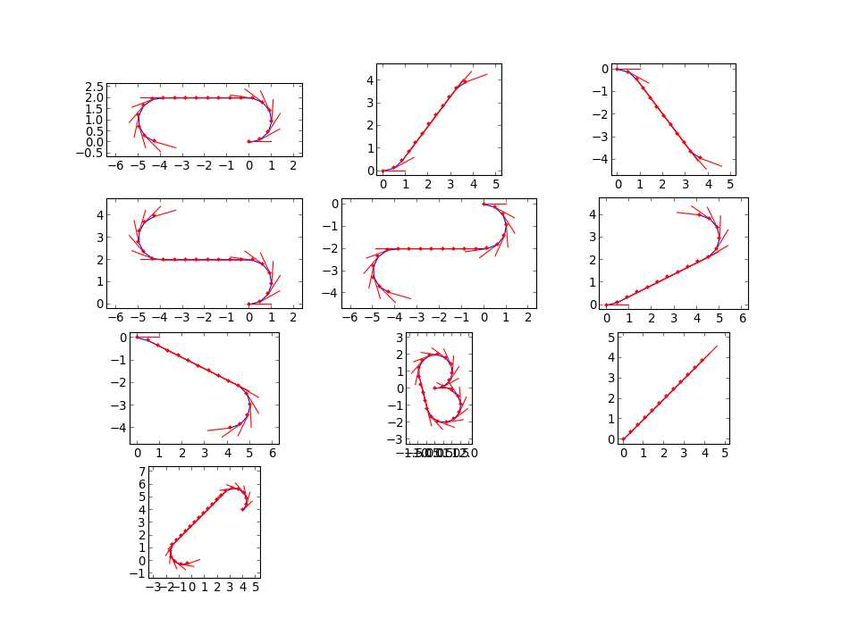
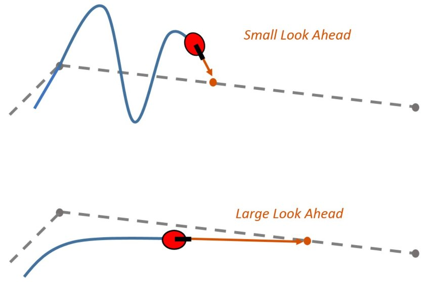
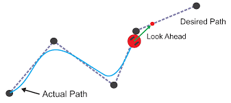
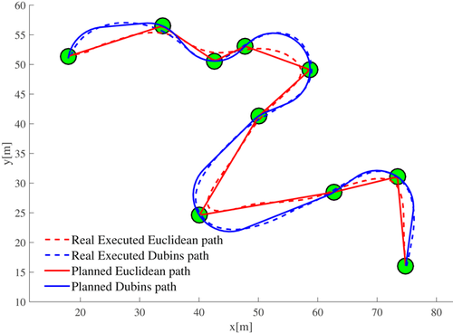
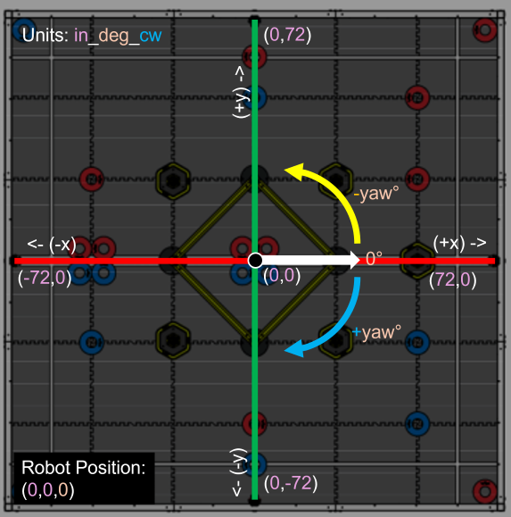
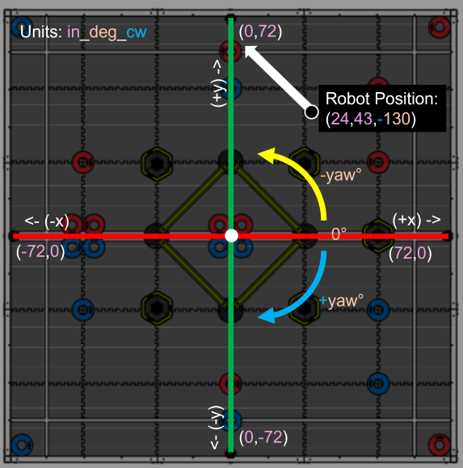

# Creating Drivetrain Object

Here we will be making the robot drivetrain object. First of all, we need to define pure pursuit parameters. These parameters will be not only used for pure pursuit but also for point turns and forward/backward movement commands too by slightly extrapolating the parameters beyond just the scope of pure pursuit.

<!-- tabs:start -->

#### **Using Default Pursuit Parameters**


If you want to use default parameters that WhoopLib uses, covering the vast majority of robot designs, just make the parameters object via:

<!-- tabs:start -->

#### **VEXCode & PROS**

```cpp
PursuitParams pursuit_parameters = PursuitParams();
```

<!-- tabs:end -->

#### **Customizing Pursuit Parameters**

If you want to tune your own custom-parameters, you can do so via the following:

<!-- tabs:start -->

#### **VEXCode & PROS**

```cpp
PursuitParams pursuit_parameters(
    5_in,    // Radius of the turns
    5_in,    // Pure Pursuit look ahead distance
    8.0_v,   // Pure pursuit forward max motor voltage (0.0, 12.0]
    12.0_v,  // Pure pursuit turning max motor voltage (0.0, 12.0]
    50.0_v,  // The maximum voltage change per second, as a slew rate (only applies speeding up)
    1.25_in, // Settle Distance. Exits when within this distance of target
    1_deg,   // Settle Rotation. Exits when within this rotation of target
    0.3_sec, // Minimum time to be considered settled, in seconds
    0_sec,   // Time after which to give up and move on, in seconds (set to 0 to disable)
    14_kp,   // Turning (kP) Proportional Tuning
    0.1_ki,  // Turning (kI) Integral Tuning
    20_kd,   // Turning (kD) Derivative Tuning
    15_deg,  // The rotation distance (error) to activate turning_ki
    55_kp,   // Forward (kP) Proportional Tuning
    0.01_ki, // Forward (kI) Integral Tuning
    250_kd,  // Forward (kD) Derivative Tuning
    2_m,     // The forward distance (error) to activate forward_ki
    100      // The number of points when generating the path. More points mean higher detail of the path, but at a higher computational cost
);

```

<!-- tabs:end -->

The WhoopLib uses the entirety of PID for turning and pure pursuit forward motion. This means that the robots movements, if configured correctly, are extremely precise to roughly ±```1.25``` inches and ±```1``` degrees for the pure pursuit's end-position. The robot uses Dubins-Curves to generate the sub-paths. Therefore, the robot simultaneously acts as a car, which is why there is a variable for the radius of the turns. Additionally, the pure pursuit look ahead distance is how far to look ahead in the path. The number of points is how many points when generating a path. Default is ```100```.

Visual representation of Dubins-Curves and turning radius:



Visual representation of the pure pursuit look-ahead distance:



The reason why Dubins Curves are superior than just point-to-point is because of Pure Pursuit under-shooting the target when applied:



However, by having a turning radius for Dubins-Curves, it is more accurate, as shown in the comparison between the two:



That is why WhoopLib uses Dubins-Curves for path generation

<!-- tabs:end -->

#### Creating the Drivetrain Class

<!-- tabs:start -->

#### **VEXCode & PROS**

```cpp
WhoopDrivetrain robot_drivetrain(
    &pursuit_parameters,  // The default pure pursuit parameters for operating the robot in autonomous
    &odom_fusion,         // Odometry fusion module
    PoseUnits::in_deg_cw, // Set default pose units if not defined. "m_deg_cw" means "meters, degrees, clockwise-positive yaw", "in_deg_ccw" means "inches, degrees, counter-clockwise-positive yaw", and so forth.
    &controller1,         // Pointer to the controller
    &left_motors,         // Pointer to the left motor group (optionally can be a list of motors as well)
    &right_motors         // Pointer to the right motor group (optionally can be a list of motors as well)
);
```

<!-- tabs:end -->

There are different types of pose units you can use:

| ```PoseUnits```     | Definition | 
|----------|:--------:|
| ```in_deg_cw```    | Inches, Degrees, Clockwise-Positive     |
| ```in_deg_ccw```    | Inches, Degrees, Counter-Clockwise-Positive     |
| ```in_rad_cw```    | Inches, Radians, Clockwise-Positive     |
| ```in_rad_ccw```    | Inches, Radians, Counter-Clockwise-Positive     |
| ```m_deg_cw```    | Meters, Degrees, Clockwise-Positive     |
| ```m_deg_ccw```    | Meters, Degrees, Counter-Clockwise-Positive     |
| ```m_rad_cw```    | Meters, Radians, Clockwise-Positive     |
| ```m_rad_ccw```    | Meters, Radians, Counter-Clockwise-Positive     |

PoseUnits has several types that you can use as your standardized field system. Here is an image example of ```in_deg_cw``` explaining how the pose system on the field will work:



As you see, ```(0,0)``` with a yaw of ```0``` displays the robot at position ```(0,0)``` facing parallel to the auton line.

If we move the robot to ```(24, 43)``` with a yaw of ```-130```, the position of the robot will be as follows:



You can see that the robot moved counter-clockwise. Since the drivetrain object is configured to be clockwise-positive, that is why the yaw is negative.