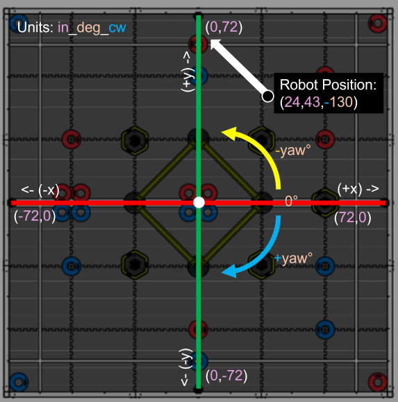

# WhoopDrivetrain Commands

WhoopLib is a library heavily specialized in autonomous functionality. Therefore there are a plethora of autonomous commands available. For this documentation, we will be using the pose units Inches, Degrees, Clockwise-Positive (```in_deg_cw```).

A more explicitly detailed illustration of ```in_deg_cw``` would be the following:


The dot with the arrow represents the position of the robot at ```0, 0``` and the arrow indicating the robot facing a yaw of ```0```.

If we move the robot to ```(24, 43)``` with a yaw of ```-130```, the position of the robot will be as follows:



Hopefully this creates a good understanding and pretense as to how the robot operates whenever given a command.

---

## turn

This turns the robot respective to its current orientation

```clike
/**
* Turns the robot relative to its current yaw
* @param angle The angle, yaw rotation to rotate by from the robot's current position
* @param timeout_seconds The timeout of the movement, in seconds
*/
void turn(double angle, double timeout_seconds=-1);
```

#### Example:

If the robot is at ```0,0```, and facing a yaw of ```30``` degrees, the following will make it turn to a yaw of ```55``` degrees:


<!-- tabs:start -->

#### **VEXCode & PROS**

```cpp
robot_drivetrain.turn(25);
```


<!-- tabs:end -->

Note that timeout_seconds by default is the pure pursuit default by setting to ```-1``` (or otherwise ignoring the parameter). However, you can set a timeout so that the robot can move after, 
for example, ```3.5``` seconds if the target position is not yet reached:

<!-- tabs:start -->

#### **VEXCode & PROS**

```cpp
// Set timeout to 3.5 seconds
robot_drivetrain.turn(25, 3.5);
```

<!-- tabs:end -->

---

## turn_to

This turns the robot to the world-space yaw.

```clike
/**
* Turns the robot to the world's yaw
* @param yaw The yaw rotation to rotate to
* @param timeout_seconds The timeout of the movement, in seconds
*/
void turn_to(double yaw, double timeout_seconds=-1);
```

#### Example:

If the robot is at ```0,0```, and facing a yaw of ```20``` degrees, the following will make it turn to a yaw of ```80``` degrees, as the current yaw of the robot has no effect on the command:

<!-- tabs:start -->

#### **VEXCode & PROS**

```cpp
robot_drivetrain.turn_to(80);
```


<!-- tabs:end -->

Note that timeout_seconds by default is the pure pursuit default by setting to ```-1``` (or otherwise ignoring the parameter). However, you can set a timeout so that the robot can move after, 
for example, ```3.5``` seconds if the target position is not yet reached:

<!-- tabs:start -->

#### **VEXCode & PROS**

```cpp
// Set timeout to 3.5 seconds
robot_drivetrain.turn_to(55, 3.5);
```

<!-- tabs:end -->

---

## turn_to_position

This function makes the robot turn to face world-space coordinates.

```clike
/**
* Turns the robot to face the given x and y
* @param x The x position to face
* @param y The y position to face
* @param timeout_seconds The timeout of the movement, in seconds
*/
void turn_to_position(double x, double y, double timeout_seconds=-1);
```

#### Example:

If the robot has a shooter, at ```0,0``` and the goal is at ```70, 30``` on the field, you can make the robot face the goal via:

<!-- tabs:start -->

#### **VEXCode & PROS**

```cpp
robot_drivetrain.turn_to_position(70, 30);
```

<!-- tabs:end -->

Note that timeout_seconds by default is the pure pursuit default by setting to ```-1``` (or otherwise ignoring the parameter). However, you can set a timeout so that the robot can move after, 
for example, ```3.5``` seconds if the target position is not yet reached:

<!-- tabs:start -->

#### **VEXCode & PROS**

```cpp
// Set timeout to 3.5 seconds
robot_drivetrain.turn_to_position(25, 30, 3.5);
```

<!-- tabs:end -->

---

## drive_forward

The following function makes the robot drive forward a specific amount of distance the robot is currently facing.

```clike
/**
* Drive the robot forward the respectable distance
* @param distance The x position to travel to, in specified units configured
* @param timeout_seconds The The timeout of the movement, in seconds
*/
void drive_forward(double distance, double timeout_seconds=-1);
```

#### Example:

To make the robot drive forward ```25``` inches:

<!-- tabs:start -->

#### **VEXCode & PROS**

```cpp
robot_drivetrain.drive_forward(25);
```

<!-- tabs:end -->

Note that timeout_seconds by default is the pure pursuit default by setting to ```-1``` (or otherwise ignoring the parameter). However, you can set a timeout so that the robot can move after, 
for example, ```3.5``` seconds if the target position is not yet reached:

<!-- tabs:start -->

#### **VEXCode & PROS**

```cpp
// Set timeout to 3.5 seconds
robot_drivetrain.drive_forward(25, 3.5);
```

<!-- tabs:end -->

---

## drive_to_point

This function makes the robot drive to a particular x and y point on the field.

```clike
/**
* This drives to a designated point using pure pursuit on a dubins curve
* @param x The x position to travel to, in specified units configured
* @param y The y position to travel to, in specified units configured
* @param timeout_seconds The timeout of the movement, in seconds
* @param landing_strip Set to -1 to default to a landing strip of lookahead_distance. Set to 0 to have no landing strip for a movemnet. Set to a
* positive non-zero to change the length
*/
void drive_to_point(double x, double y, double timeout_seconds=-1, double landing_strip = -1);
```

#### Example:

To make the robot drive to location ```-10, 25```

<!-- tabs:start -->

#### **VEXCode & PROS**

```cpp
robot_drivetrain.drive_to_point(-10, 25);
```

<!-- tabs:end -->

Note that timeout_seconds by default is the pure pursuit default by setting to ```-1``` (or otherwise ignoring the parameter). However, you can set a timeout so that the robot can move after, 
for example, ```3.5``` seconds if the target position is not yet reached:

<!-- tabs:start -->

#### **VEXCode & PROS**

```cpp
// Set timeout to 3.5 seconds
robot_drivetrain.drive_to_point(-10, 25, 3.5);
```

<!-- tabs:end -->

The landing strip is a straight line allocation near the end of the path. Think of this as a runway that a plane lands on before it goes to a screetching halt. In this case, the runway is a
virtual strip, in inches (for this example, due to ```in_deg_cw```) that allows the robot to straighten out before stopping at its destination. Setting it to ```-1``` defaults to the pursuit
lookahead distance from the pure pursuit parameters. Setting to ```0``` can allow the robot to move more freely in very close movements by not having a landing strip, however if the robot
is moving decently fast it may overshoot if set to ```0``` and either freeze or oscillate a bit.

<!-- tabs:start -->

#### **VEXCode & PROS**

```cpp
// Set timeout_seconds to use default (via setting to -1), while having a landing strip of 5 inches
robot_drivetrain.drive_to_point(-10, 25, -1, 5);
```

<!-- tabs:end -->

---

## drive_to_pose

This function drives the robot to a pose. That is an x, y, and yaw. This should be the standard method for driving for the vast majority of cases.

```clike
/**
* This drives to a designated pose using pure pursuit on a dubins curve
* @param x The x position to travel to, in specified units configured
* @param y The y position to travel to, in specified units configured
* @param yaw The yaw rotation to travel to, in specified units configured
* @param timeout_seconds The timeout of the movement, in seconds
* @param turning_radius The radius, in meters, of the turning
* @param landing_strip Set to -1 to default to a landing strip of lookahead_distance. Set to 0 to have no landing strip for a movemnet. Set to a
* positive non-zero to change the length
*/
void drive_to_pose(double x, double y, double yaw, double timeout_seconds=-1, double turning_radius=-1, double landing_strip = -1);
```

#### Example:

To make the robot drive to location ```-10, 25```, and face a yaw of ```-30``` degrees

<!-- tabs:start -->

#### **VEXCode & PROS**

```cpp
robot_drivetrain.drive_to_pose(-10, 25, -30);
```

<!-- tabs:end -->

Note that timeout_seconds by default is the pure pursuit default by setting to ```-1``` (or otherwise ignoring the parameter). However, you can set a timeout so that the robot can move after, 
for example, ```3.5``` seconds if the target position is not yet reached:

<!-- tabs:start -->

#### **VEXCode & PROS**

```cpp
// Set timeout to 3.5 seconds
robot_drivetrain.drive_to_pose(-10, 25, -30, 3.5);
```

<!-- tabs:end -->

The turning radius is like the equivalent of the turning radius of a car. A tighter radius can be more space efficient, but it can cause the robot to yank itself really quickly around a corner. 
However, a larger turning radius would be less space efficient but the robot would not yank itself as dramatically. You can set it to ```-1``` to use the default turning radius parameter of the
pure pursuit defaults, or you can set to a non-zero positive number in inches (as the example is in ```in_deg_cw```):

<!-- tabs:start -->

#### **VEXCode & PROS**

```cpp
// Set timeout to 3.5 seconds and turning radius to 6 inches
robot_drivetrain.drive_to_pose(-10, 25, -30, 3.5, 6);
```

<!-- tabs:end -->

The landing strip is a straight line allocation near the end of the path. Think of this as a runway that a plane lands on before it goes to a screetching halt. In this case, the runway is a
virtual strip, in inches (for this example, due to ```in_deg_cw```) that allows the robot to straighten out before stopping at its destination. Setting it to ```-1``` defaults to the pursuit
lookahead distance from the pure pursuit parameters. Setting to ```0``` can allow the robot to move more freely in very close movements by not having a landing strip, however if the robot
is moving decently fast it may overshoot if set to ```0``` and either freeze or oscillate a bit.

<!-- tabs:start -->

#### **VEXCode & PROS**

```cpp
// Set timeout_seconds to use default (via setting to -1), turning radius of 6 inches, while having a landing strip of 5 inches
robot_drivetrain.drive_to_pose(-10, 25, -30, -1, 6, 5);
```

<!-- tabs:end -->

---

## drive_through_path

Instead of doing multiple driving to poses, which will make the robot stop and go repeatedly, you can instead provide these same poses as "waypoints" in an array/vector.

```clike
/**
* This drives to a designated pose using pure pursuit on a dubins curve
* @param waypoints The waypoints for generating the path. Example would be {TwoDPose(0,0,0), TwoDPose(20,10,M_PI_2)}
* The yaw for each position in the list must be explicitly stated when using TwoDPose objects
* @param timeout_seconds The timeout of the movement, in seconds
* @param turning_radius The radius, in meters, of the turning
* @param landing_strip Set to -1 to default to a landing strip of lookahead_distance. Set to 0 to have no landing strip for a movemnet. Set to a
* positive non-zero to change the length
*/
void drive_through_path(std::vector<std::vector<double>> waypoints, double timeout_seconds=-1, double turning_radius=-1, double landing_strip = -1);
```

#### Example:

To have the robot drive to point ```15, 15``` at yaw ```0``` and then drive to the destination of ```0,0``` at yaw ```90```:

<!-- tabs:start -->

#### **VEXCode & PROS**

```cpp
robot_drivetrain.drive_through_path({{15, 15, 0}, {0, 0, 90}});
```

<!-- tabs:end -->

Note that timeout_seconds by default is the pure pursuit default by setting to ```-1``` (or otherwise ignoring the parameter). However, you can set a timeout so that the robot can move after, 
for example, ```3.5``` seconds if the target position is not yet reached:

<!-- tabs:start -->

#### **VEXCode & PROS**

```cpp
// Set timeout to 3.5 seconds
robot_drivetrain.drive_through_path({{15, 15, 0}, {0, 0, 90}}, 3.5);
```

<!-- tabs:end -->

The turning radius is like the equivalent of the turning radius of a car. A tighter radius can be more space efficient, but it can cause the robot to yank itself really quickly around a corner. 
However, a larger turning radius would be less space efficient but the robot would not yank itself as dramatically. You can set it to ```-1``` to use the default turning radius parameter of the
pure pursuit defaults, or you can set to a non-zero positive number in inches (as the example is in ```in_deg_cw```):

<!-- tabs:start -->

#### **VEXCode & PROS**

```cpp
// Set timeout to 3.5 seconds and turning radius to 6 inches
robot_drivetrain.drive_through_path({{15, 15, 0}, {0, 0, 90}}, 3.5, 6);
```

<!-- tabs:end -->

The landing strip is a straight line allocation near the end of the path. Think of this as a runway that a plane lands on before it goes to a screetching halt. In this case, the runway is a
virtual strip, in inches (for this example, due to ```in_deg_cw```) that allows the robot to straighten out before stopping at its destination. Setting it to ```-1``` defaults to the pursuit
lookahead distance from the pure pursuit parameters. Setting to ```0``` can allow the robot to move more freely in very close movements by not having a landing strip, however if the robot
is moving decently fast it may overshoot if set to ```0``` and either freeze or oscillate a bit.

<!-- tabs:start -->

#### **VEXCode & PROS**

```cpp
// Set timeout_seconds to use default (via setting to -1), turning radius of 6 inches, while having a landing strip of 5 inches
robot_drivetrain.drive_through_path({{15, 15, 0}, {0, 0, 90}}, -1, 6, 5); 
```

<!-- tabs:end -->

---

## reverse_backward

This does similar to drive_forwards however in reverse.

```clike
/**
* Drive the robot backward the respectable distance
* @param distance The x position to travel to, in specified units configured
* @param timeout_seconds The The timeout of the movement, in seconds
*/
void reverse_backward(double distance, double timeout_seconds=-1);
```

#### Example:

To make the robot drive backwards ```25``` inches:

<!-- tabs:start -->

#### **VEXCode & PROS**

```cpp
robot_drivetrain.reverse_backward(25);
```

<!-- tabs:end -->

Note that timeout_seconds by default is the pure pursuit default by setting to ```-1``` (or otherwise ignoring the parameter). However, you can set a timeout so that the robot can move after, 
for example, ```3.5``` seconds if the target position is not yet reached:

<!-- tabs:start -->

#### **VEXCode & PROS**

```cpp
// Set timeout to 3.5 seconds
robot_drivetrain.reverse_backward(25, 3.5);
```

<!-- tabs:end -->

---

## reverse_to_point

Drives the robot backwards to a given point. Same thing as drive_to_point but in reverse.

```clike
/**
* This drives to a designated point using pure pursuit on a dubins curve, in reverse
* @param x The x position to travel to, in specified units configured
* @param y The y position to travel to, in specified units configured
* @param timeout_seconds The timeout of the movement, in seconds
* @param landing_strip Set to -1 to default to a landing strip of lookahead_distance. Set to 0 to have no landing strip for a movemnet. Set to a
* positive non-zero to change the length
*/
void reverse_to_point(double x, double y, double timeout_seconds=-1, double landing_strip = -1);
```

#### Example:

To make the robot drive to location ```-10, 25``` in reverse

<!-- tabs:start -->

#### **VEXCode & PROS**

```cpp
robot_drivetrain.reverse_to_point(-10, 25);
```

<!-- tabs:end -->

Note that timeout_seconds by default is the pure pursuit default by setting to ```-1``` (or otherwise ignoring the parameter). However, you can set a timeout so that the robot can move after, 
for example, 3.5 seconds if the target position is not yet reached:

<!-- tabs:start -->

#### **VEXCode & PROS**

```cpp
// Set timeout to 3.5 seconds
robot_drivetrain.reverse_to_point(-10, 25, 3.5);
```

<!-- tabs:end -->

The landing strip is a straight line allocation near the end of the path. Think of this as a runway that a plane lands on before it goes to a screetching halt. In this case, the runway is a
virtual strip, in inches (for this example, due to ```in_deg_cw```) that allows the robot to straighten out before stopping at its destination. Setting it to ```-1``` defaults to the pursuit
lookahead distance from the pure pursuit parameters. Setting to ```0``` can allow the robot to move more freely in very close movements by not having a landing strip, however if the robot
is moving decently fast it may overshoot if set to ```0``` and either freeze or oscillate a bit.

<!-- tabs:start -->

#### **VEXCode & PROS**

```cpp
// Set timeout_seconds to use default (via setting to -1), while having a landing strip of 5 inches
robot_drivetrain.reverse_to_point(-10, 25, -1, 5); 
```

<!-- tabs:end -->

---

## reverse_to_pose

This function is the equivalent of drive_to_pose, but in reverse. Note that the backside of the robot becomes the temporary "front" of the robot for the duration of the reversal.
So driving to ```10, 25, -80``` in reverse would result in the robot's pose to be at ```10, 25, ```(-80+180)=```100``` degrees

```clike
/**
* This drives to a designated pose using pure pursuit on a dubins curve, in reverse
* @param x The x position to travel to, in specified units configured
* @param y The y position to travel to, in specified units configured
* @param yaw The yaw rotation to travel to, in specified units configured
* @param timeout_seconds The timeout of the movement, in seconds
* @param turning_radius The radius, in meters, of the turning
* @param landing_strip Set to -1 to default to a landing strip of lookahead_distance. Set to 0 to have no landing strip for a movemnet. Set to a
* positive non-zero to change the length
*/
void reverse_to_pose(double x, double y, double yaw, double timeout_seconds=-1, double turning_radius=-1, double landing_strip = -1);
```

#### Example:

To make the robot drive to location ```-10, 25```, and have the back of the robot face a yaw of ```-30``` degrees

<!-- tabs:start -->

#### **VEXCode & PROS**

```cpp
robot_drivetrain.reverse_to_point(-10, 25, -30);
```

<!-- tabs:end -->

Note that timeout_seconds by default is the pure pursuit default by setting to ```-1``` (or otherwise ignoring the parameter). However, you can set a timeout so that the robot can move after, 
for example, ```3.5``` seconds if the target position is not yet reached:

<!-- tabs:start -->

#### **VEXCode & PROS**

```cpp
// Set timeout to 3.5 seconds
robot_drivetrain.reverse_to_point(-10, 25, -30, 3.5);
```

<!-- tabs:end -->

The turning radius is like the equivalent of the turning radius of a car. A tighter radius can be more space efficient, but it can cause the robot to yank itself really quickly around a corner. 
However, a larger turning radius would be less space efficient but the robot would not yank itself as dramatically. You can set it to ```-1``` to use the default turning radius parameter of the
pure pursuit defaults, or you can set to a non-zero positive number in inches (as the example is in ```in_deg_cw```):

<!-- tabs:start -->

#### **VEXCode & PROS**

```cpp
// Set timeout to 3.5 seconds and turning radius to 6 inches
robot_drivetrain.reverse_to_point(-10, 25, -30, 3.5, 6); 
```

<!-- tabs:end -->

The landing strip is a straight line allocation near the end of the path. Think of this as a runway that a plane lands on before it goes to a screetching halt. In this case, the runway is a
virtual strip, in inches (for this example, due to ```in_deg_cw```) that allows the robot to straighten out before stopping at its destination. Setting it to ```-1``` defaults to the pursuit
lookahead distance from the pure pursuit parameters. Setting to ```0``` can allow the robot to move more freely in very close movements by not having a landing strip, however if the robot
is moving decently fast it may overshoot if set to ```0``` and either freeze or oscillate a bit.

<!-- tabs:start -->

#### **VEXCode & PROS**

```cpp
// Set timeout_seconds to use default (via setting to -1), turning radius of 6 inches, while having a landing strip of 5 inches
robot_drivetrain.reverse_to_point(-10, 25, -30, -1, 6, 5);
```

<!-- tabs:end -->

---

## reverse_through_path

This function is the equivalent of reverse_through_path, but in reverse. Note that the backside of the robot becomes the temporary "front" of the robot for the duration of the reversal.
So driving to ```10, 25, -80``` in reverse would result in the robot's pose to be at ```10, 25, ```(-80+180)=```100``` degrees

```clike
/**
* This drives to a designated pose using pure pursuit on a dubins curve, in reverse
* @param waypoints The waypoints for generating the path. Example would be {TwoDPose(0,0,0), TwoDPose(20,10,M_PI_2)}
* The yaw for each position in the list must be explicitly stated when using TwoDPose objects
* @param timeout_seconds The timeout of the movement, in seconds
* @param turning_radius The radius, in meters, of the turning
* @param landing_strip Set to -1 to default to a landing strip of lookahead_distance. Set to 0 to have no landing strip for a movemnet. Set to a
* positive non-zero to change the length
*/
void reverse_through_path(std::vector<std::vector<double>> waypoints, double timeout_seconds=-1, double turning_radius=-1, double landing_strip = -1);
```

#### Example:

To have the robot drive to point ```15, 15``` with the back of the robot facing a yaw ```0``` and then drive to the destination of ```0,0``` with the backside of the robot face yaw ```90```:

<!-- tabs:start -->

#### **VEXCode & PROS**

```cpp
robot_drivetrain.reverse_through_path({{15, 15, 0}, {0, 0, 90}});
```

<!-- tabs:end -->

Note that timeout_seconds by default is the pure pursuit default by setting to ```-1``` (or otherwise ignoring the parameter). However, you can set a timeout so that the robot can move after, 
for example, ```3.5``` seconds if the target position is not yet reached:

<!-- tabs:start -->

#### **VEXCode & PROS**

```cpp
// Set timeout to 3.5 seconds
robot_drivetrain.reverse_through_path({{15, 15, 0}, {0, 0, 90}}, 3.5);
```

<!-- tabs:end -->

The turning radius is like the equivalent of the turning radius of a car. A tighter radius can be more space efficient, but it can cause the robot to yank itself really quickly around a corner. 
However, a larger turning radius would be less space efficient but the robot would not yank itself as dramatically. You can set it to ```-1``` to use the default turning radius parameter of the
pure pursuit defaults, or you can set to a non-zero positive number in inches (as the example is in ```in_deg_cw```):

<!-- tabs:start -->

#### **VEXCode & PROS**

```cpp
// Set timeout to 3.5 seconds and turning radius to 6 inches
robot_drivetrain.reverse_through_path({{15, 15, 0}, {0, 0, 90}}, 3.5, 6);
```

<!-- tabs:end -->

The landing strip is a straight line allocation near the end of the path. Think of this as a runway that a plane lands on before it goes to a screetching halt. In this case, the runway is a
virtual strip, in inches (for this example, due to ```in_deg_cw```) that allows the robot to straighten out before stopping at its destination. Setting it to ```-1``` defaults to the pursuit
lookahead distance from the pure pursuit parameters. Setting to ```0``` can allow the robot to move more freely in very close movements by not having a landing strip, however if the robot
is moving decently fast it may overshoot if set to ```0``` and either freeze or oscillate a bit.

<!-- tabs:start -->

#### **VEXCode & PROS**

```cpp
// Set timeout_seconds to use default (via setting to -1), turning radius of 6 inches, while having a landing strip of 5 inches
robot_drivetrain.reverse_through_path({{15, 15, 0}, {0, 0, 90}}, -1, 6, 5);
```

<!-- tabs:end -->

---

## wait_until_completed

If the robot is given a movement command, and you want to do an action after a move completes, there is a wait_until_completed command:

```clike
/**
* Waits until a drivetrain action during auton is complete.
*/
void wait_until_completed();
```

#### Example:

<!-- tabs:start -->

#### **VEXCode & PROS**

```cpp
robot_drivetrain.set_pose_units(PoseUnits::in_deg_cw);
robot_drivetrain.set_pose(0,0,0); // Set the robot's starting position

robot_drivetrain.reverse_through_path({{15, 15, 0}, {0, 0, 90}}, 3.5); // Timeout of 3.5 seconds
// Your code here to run while the robot is turning
robot_drivetrain.wait_until_completed(); // Wait until the last command is complete before continuing
// Your code here to run after the robot finished turning
robot_drivetrain.reverse_to_point(-12, 5, 3.5);
```

<!-- tabs:end -->

---

## set_state

Sets the state of the robot (usually to be handled upon startup)

```clike
/**
* Sets the operational state of the drivetrain.
* @param state The new state to set (disabled, autonomous, or user control).
*/
void set_state(drivetrainState state);
```

| ```drivetrainState```     | Definition | 
|----------|:--------:|
| ```mode_disabled```    | Prohibits the drivetrain from moving at all     |
| ```mode_autonomous```    | Allows autonomous functions, and prohibits controller control for the drivetrain     |
| ```mode_usercontrol```    | Allows controller control for the drivetrain, and prohibits autonomous functions  |

#### Example:

<!-- tabs:start -->

#### **VEXCode**

```cpp
void pre_auton()
{
    // Initializing Robot Configuration. DO NOT REMOVE!
    vexcodeInit();
    manager.start();
    robot_drivetrain.set_state(drivetrainState::mode_disabled);
}

void autonomous()
{
    robot_drivetrain.set_state(drivetrainState::mode_autonomous);
    // autonomous stuff here
}

void usercontrol()
{
    robot_drivetrain.set_state(drivetrainState::mode_usercontrol);

    // User control code here, inside the loop
    while (1)
    {
        wait(10, msec);
    }
}
```

#### **PROS**

```cpp
void disabled()
{
    robot_drivetrain.set_state(drivetrainState::mode_disabled);
}

void autonomous()
{
    robot_drivetrain.set_state(drivetrainState::mode_autonomous);

    robot_drivetrain.set_pose_units(PoseUnits::in_deg_cw);
    robot_drivetrain.set_pose(0, 0, 0);

    // robot_drivetrain.turn_to_position(15, 15);
    robot_drivetrain.drive_forward(15);

    robot_drivetrain.turn_to(90);

    robot_drivetrain.drive_forward(-15);

    robot_drivetrain.drive_forward(15);

    robot_drivetrain.turn_to(0);

    robot_drivetrain.drive_forward(-15);

    // robot_drivetrain.drive_to_point(15, 15);
    // robot_drivetrain.reverse_to_point(0,0);
    robot_drivetrain.drive_through_path({{15, 15, 0}, {0, 0, 90}}, 7);
    robot_drivetrain.reverse_through_path({{15, 15, 180}, {0, 0, 180}}, 7);
}

void opcontrol()
{
    robot_drivetrain.set_state(drivetrainState::mode_usercontrol);

    while (true)
    {
        Pose current_pose = robot_drivetrain.get_pose();
        pros::lcd::clear_line(3);
        pros::lcd::print(3, "FO (%s): %.1f %.1f %.1f %.1f %.1f %.1f", robot_drivetrain.get_units_str().c_str(), current_pose.x, current_pose.y, current_pose.z, current_pose.pitch, current_pose.yaw, current_pose.roll);

        pros::delay(20); // Run for 20 ms then update
    }
}
```

<!-- tabs:end -->

---

## calibrate

Calibrates the IMU, tares all rotation sensors used in the drivetrain, and tares the IMU.

```clike
/**
* Calibrates the robot drivetrain
*/
void calibrate();
```

#### Example:


<!-- tabs:start -->

#### **VEXCode**

```cpp
void pre_auton() {
    // Initializing Robot Configuration. DO NOT REMOVE!
    vexcodeInit();
    manager.start();
    jetson_commander.initialize(); // If you don't have Tesseract, omit this line
    robot_drivetrain.calibrate();
    robot_drivetrain.set_state(drivetrainState::mode_disabled);

}
```

#### **PROS**

```cpp
void initialize()
{
    pros::lcd::initialize();
    pros::lcd::set_text(1, "Hello PROS User!");
    controller1.notify("Initializing");
    manager.start();
    jetson_commander.initialize(); // If you don't have Tesseract, omit this line
    robot_drivetrain.calibrate();

}

void disabled()
{
    robot_drivetrain.set_state(drivetrainState::mode_disabled);
}
```

<!-- tabs:end -->

---

## set_pose_units

```clike
/**
* Sets the pose units for the system. This can be changed at any point in time, even mid-autonomous
*/
void set_pose_units(PoseUnits units);
```

| ```PoseUnits```     | Definition | 
|----------|:--------:|
| ```in_deg_cw```    | Inches, Degrees, Clockwise-Positive     |
| ```in_deg_ccw```    | Inches, Degrees, Counter-Clockwise-Positive     |
| ```in_rad_cw```    | Inches, Radians, Clockwise-Positive     |
| ```in_rad_ccw```    | Inches, Radians, Counter-Clockwise-Positive     |
| ```m_deg_cw```    | Meters, Degrees, Clockwise-Positive     |
| ```m_deg_ccw```    | Meters, Degrees, Counter-Clockwise-Positive     |
| ```m_rad_cw```    | Meters, Radians, Clockwise-Positive     |
| ```m_rad_ccw```    | Meters, Radians, Counter-Clockwise-Positive     |

#### Example:

<!-- tabs:start -->

#### **VEXCode & PROS**

```cpp
void autonomous()
{
    robot_drivetrain.set_state(drivetrainState::mode_autonomous);

    robot_drivetrain.set_pose_units(PoseUnits::in_deg_cw);
    robot_drivetrain.set_pose(0,0,0);

    //robot_drivetrain.turn_to_position(15, 15);
    robot_drivetrain.drive_forward(15);
}
```

<!-- tabs:end -->

---

## get_pose

```clike
/**
* Gets the x, y, z, pitch, yaw, roll of the robot
* @return Pose object. With Pose.x, Pose.y, etc...
*/
Pose get_pose();
```

#### Example:

<!-- tabs:start -->

#### **VEXCode**

```cpp
void usercontrol()
{
  robot_drivetrain.set_state(drivetrainState::mode_usercontrol);

  // User control code here, inside the loop
  while (true)
  {
    Pose current_pose = robot_drivetrain.get_pose();
    Brain.Screen.clearLine(4);
    Brain.Screen.setCursor(4, 1);
    Brain.Screen.print("FO (%s): %.1f %.1f %.1f %.1f %.1f %.1f", robot_drivetrain.get_units_str().c_str(), current_pose.x, current_pose.y, current_pose.z, current_pose.pitch, current_pose.yaw, current_pose.roll);

    wait(20, msec);
  }
}

```

#### **PROS**

```cpp
void opcontrol()
{
    robot_drivetrain.set_state(drivetrainState::mode_usercontrol);

    while (true)
    {
        Pose current_pose = robot_drivetrain.get_pose();
        pros::lcd::clear_line(3);
        pros::lcd::print(3, "FO (%s): %.1f %.1f %.1f %.1f %.1f %.1f", robot_drivetrain.get_units_str().c_str(), current_pose.x, current_pose.y, current_pose.z, current_pose.pitch, current_pose.yaw, current_pose.roll);

        pros::delay(20); // Run for 20 ms then update
    }
}
```

<!-- tabs:end -->

---

## set_pose

```clike
/**
* Sets the pose of the robot
* @param x_in the location, in inches, parallel to the width of the driver station
* @param y_in the location, in inches, perpendicular to the width of the driver station
* @param yaw_deg the rotation, clockwise-positive, in degrees
*/
void set_pose(double x_in, double y_in, double yaw_deg);
```

#### Example (setting pose to 15, 5 at yaw 45 degrees):

<!-- tabs:start -->

#### **VEXCode & PROS**

```cpp
void autonomous()
{
    robot_drivetrain.set_state(drivetrainState::mode_autonomous);

    robot_drivetrain.set_pose_units(PoseUnits::in_deg_cw);
    robot_drivetrain.set_pose(15,5,45);
}
```

<!-- tabs:end -->
