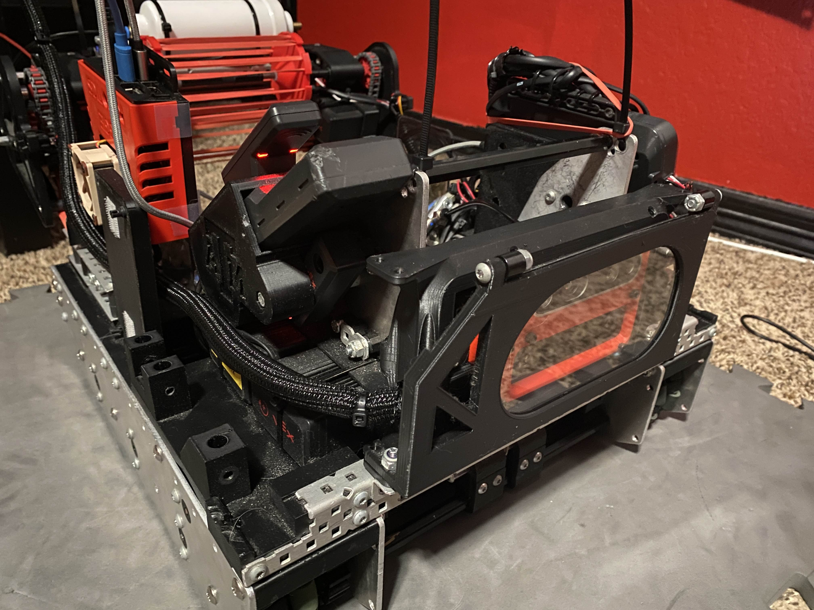

# The Most Powerful SLAM Solution in VEX.

[![LinkedIn][linkedin-shield]][linkedin-url]
<!-- MARKDOWN LINKS & IMAGES -->
<!-- https://www.markdownguide.org/basic-syntax/#reference-style-links -->
[linkedin-shield]: https://img.shields.io/badge/-LinkedIn-black.svg?style=for-the-badge&logo=linkedin&colorB=555
[linkedin-url]: https://www.linkedin.com/in/connor-white-38a5501a0/

[WhoopLib Documentation](https://connoratmos.github.io/WhoopLib/)

[WhoopLib Zero - Learn C++ From Zero](https://connoratmos.github.io/WhoopLibZero/)

[WhoopLibVEXCode Github](https://github.com/ConnorAtmos/WhoopLibVEXCode)

[WhoopLibPROS Github](https://github.com/ConnorAtmos/WhoopLibPROS)

[WhoopLibPython Github](https://github.com/ConnorAtmos/WhoopLibPython)
