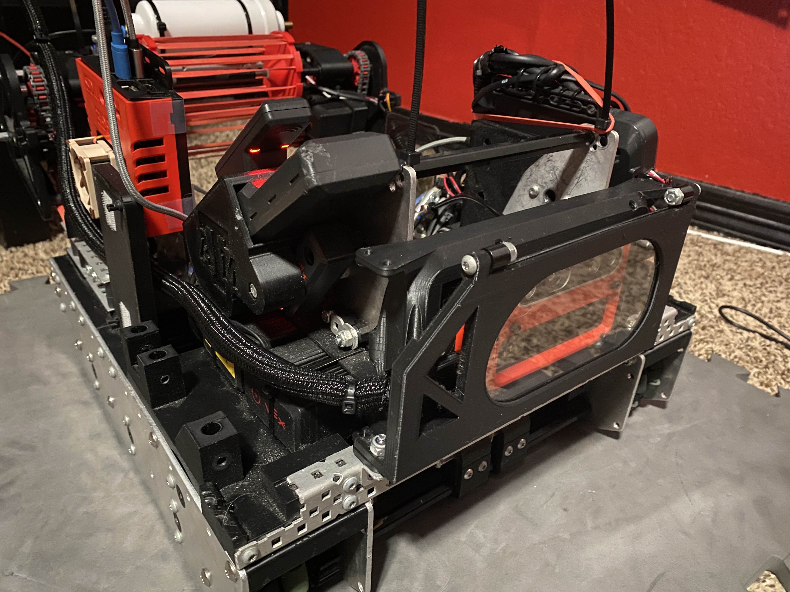

# The Most Advanced SLAM Solution in VEX.

<iframe width="560" height="315" src="https://www.youtube.com/embed/0wucfcDo82k?si=yLJJdyoI7KJ_m6on" title="YouTube video player" frameborder="0" allow="accelerometer; autoplay; clipboard-write; encrypted-media; gyroscope; picture-in-picture; web-share" referrerpolicy="strict-origin-when-cross-origin" allowfullscreen></iframe>

[WhoopLib Documentation](https://CorniiDog.github.io/WhoopLib/)

[WhoopLib Zero - Learn C++ From Zero](https://CorniiDog.github.io/WhoopLibZero/)

[WhoopLibVEXCode Github](https://github.com/CorniiDog/WhoopLibVEXCode)

[WhoopLibPROS Github](https://github.com/CorniiDog/WhoopLibPROS)

[WhoopLibPython Github](https://github.com/CorniiDog/WhoopLibPython)
