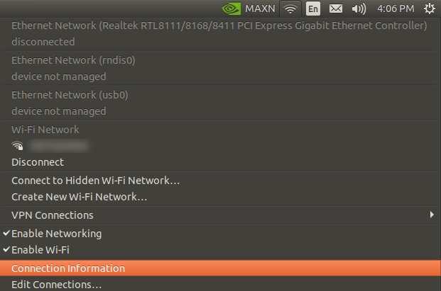
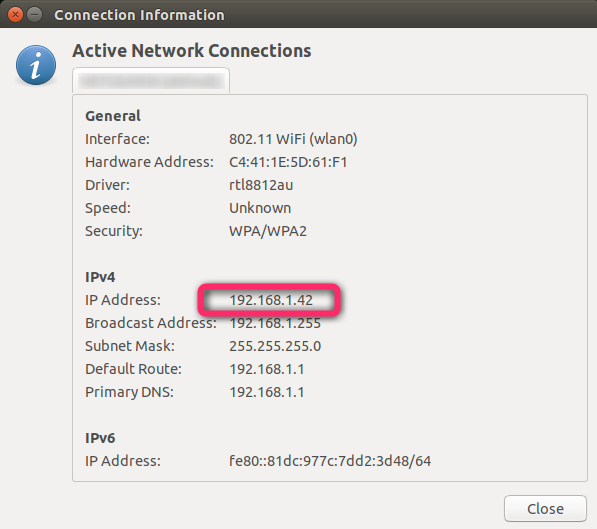

# Installation & Setup

The installation process for the vision system is likely the most complicated part. So, in an attempt to streamline the process
we have provided enough documentation to either install from a backup file or build from source.

## Installing WiFi Module

Refer to [This Link](https://kb.vex.com/hc/en-us/articles/360048489132-Installing-the-Intel-Dual-Band-Wi-Fi-and-Antennas-for-VEX-AI) that
properly explains how to install the WiFi module onto the Jetson Nano

## Instructions To Install WhoopLib OS On Jetson

> For Jetson Nano: [Instructions](https://docs.google.com/document/d/1R466WGGEFfLnCq74Ui_tFQveaQ1RHnSQTE2j4t9e8I4/edit?usp=sharing)\

## Connect Jetson Nano to WiFi

1. Connect a montitor, keyboard, and mouse to the Jetson Nano

2. Connect to the wifi network (Image for Reference):\


3. Click "Connection Information" and take note of the ip address. This is the IP address for your Jetson Nano for the next step\



## Update to Latest Deployment

1. SSH into your jetson nano via "```ssh jetson@your_jetson_ip```"\
With "your_jetson_ip" as the ip address of the jetson on the network.

2. Password should be "```jetson```"

3. Run the following to update to the latest version of the WhoopLibPython and restart the subsystem:
```bash
  cd ~/Desktop/WhoopLibPython

  git pull

  sudo systemctl restart whooplibpython.service
```

